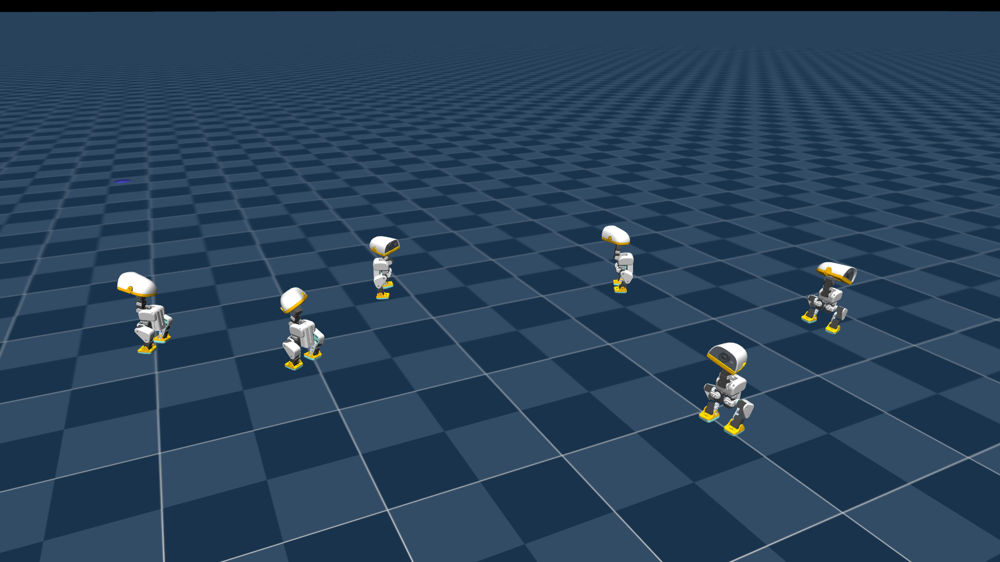
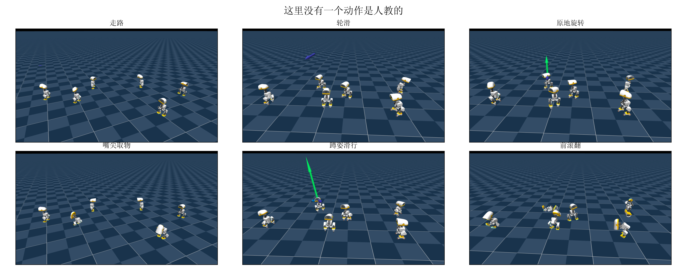
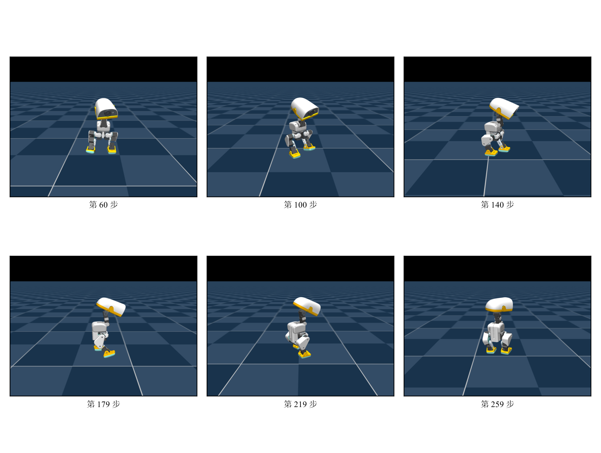
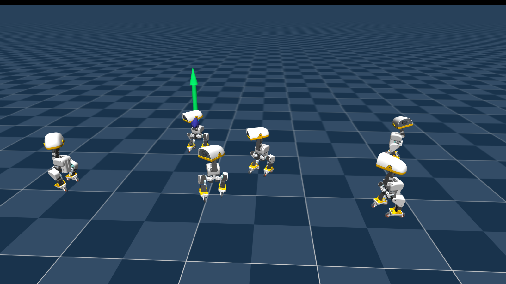
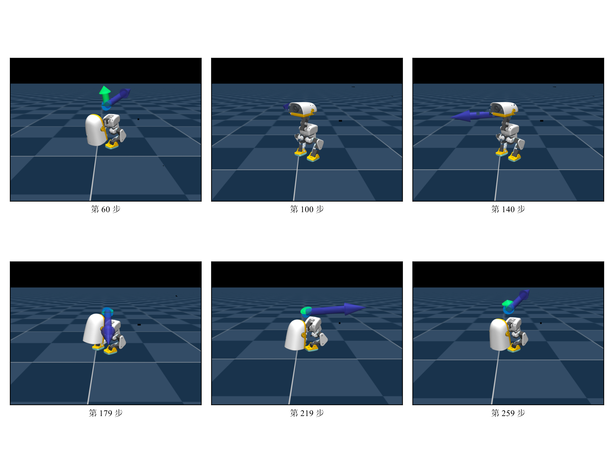
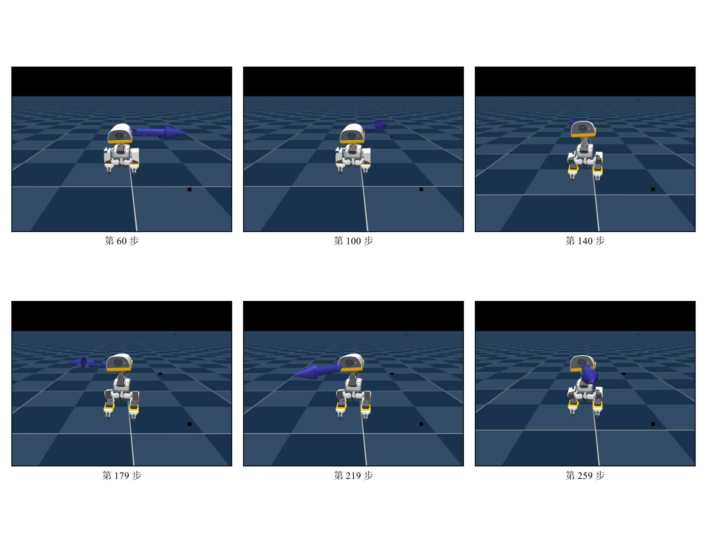

一只 800 克、25 厘米高的双足小鸭子，站在一块什么都没有的平地上。它有 14 个舵机，
每秒被指挥 50 次。没有人教它怎么走。



上面这些动作，它全都是自己试出来的：按指令朝任意方向走，脚下换成轮子后滑行，
原地飞快旋转，低头用嘴尖碰到地面上的东西，在滑行中蹲低身体保持住，还能向前翻一个跟头再站回来。
**这里没有一个动作是人教的。** 没有示教数据，没有动作捕捉，没有任何一条"这一步该做什么"
的标准答案，只有一个能打分的函数，和大量的失败。

这一讲讲的就是这件事怎么可能。我们会先把"学走路"翻译成强化学习的语言，
建立一张不会混淆的方法分类地图，然后沿着地图上一条主线，从最朴素的做法出发，
每讲完一个算法就在同一个任务上跑给你看——看到它的毛病，再引出下一个算法——
一路走到工业界在用的那套配方。最后把同一套配方原样换到别的动作上，看它能学出多少花样。

这一讲是**独立起点**：读它不需要任何前置章节。策略、闭环、观测这些词都在篇内从零讲清。
全篇只在仿真里进行。

# 1 不给答案，只给分数

## 1.1 为什么这只鸭子没法靠示教教会

教一个机器人做事，最直接的办法是**示范给它看**：人操作一遍，把每一时刻的动作记下来，
然后让网络去模仿。这套办法在很多地方管用——比如带着机械臂的手把一个杯子拿起来，
人的手怎么动、夹爪怎么合，都能一一录下。

放到这只鸭子身上，它立刻失效，有三个层次的原因。

**第一层，采不到。** 走路不是一个姿势，是 14 个关节以每秒 50 次的频率协调发力。
人有两条腿，但人的腿和这只鸭子的腿在长度比例、质量分布、关节限位上都不一样，
"我怎么走"照搬过去它站不住。就算你想逐关节遥操作，一只手也管不了 14 个自由度，
更别说要在毫秒级上保持配合。

**第二层，示范不告诉你哪种更好。** 假设真采到了一段能走的示范，模仿学习的目标是
"贴近这段示范"。但示范里没有"这样走比那样走更省力"、"这个步幅更抗推"这类信息——
监督信号只回答"这一步该做什么"，不回答"这一步做得好不好"。想要机器人自己找到
比示范者更好的做法，模仿这条路上没有这个概念。

**第三层，走错了没人救。** 闭环控制里误差会滚雪球：机器人的动作影响下一时刻的状态，
一旦偏离到示范数据没覆盖过的姿态，网络就两眼一抹黑——那里没有标签。而一只 25 厘米高、
重心偏上的双足机器人，偏离到"没见过的姿态"只需要一次踉跄。

三层的根源是同一个：**示教给的是"该做什么"，而我们需要的是"做得怎么样"。**

## 1.2 换一种监督信号：不给答案，只给分数

"做得怎么样"用一个标量就能表达：**奖励**（reward）。

把机器人放进一个可以反复重来的环境里。每当它做出一个动作，环境做两件事：
转移到新的状态，并吐回一个分数。分数怎么给由我们设计——比如"朝指令方向走得越准分越高"、
"躯干越直分越高"、"关节抖得越厉害扣分越多"。机器人不知道这个分数是怎么算出来的，
它只知道自己拿到了多少。

于是训练变成了这样一个循环：机器人看一眼当前状态，做一个动作，拿到一个分数和一个新状态；
如此反复。它要做的是**调整自己的行为，让长期累计的分数尽可能高**。这就是强化学习
（Reinforcement Learning）。

<!-- 图 14-3：带奖励回路的交互闭环示意。观测 → 动作 → 环境 → 新观测，
     并在回路上多出一条"每一步带回一个奖励"。 -->

这个改动看着小，但它把两件事换掉了。

**一是监督信号的性质。** 模仿学习的每条训练样本都带着动作标签，属于监督学习；
强化学习没有标签，只有事后的评分，而且评分往往还是延迟的——现在这一步好不好，
可能要几十步之后摔了才知道。

**二是数据的来源。** 模仿学习的数据集是事先采好的、静态的；强化学习的训练数据
**是机器人自己跑出来的**。它跑一段轨迹，连同每一步的分数，就是这一轮的训练集。
策略一变，下一轮跑出来的数据分布也跟着变。这是两者在工程形态上最大的差别，
也是后面讨论"这些自产数据该怎么用"的起点。

## 1.3 策略是什么：从看到的东西到该做的动作

贯穿全篇的主角是一个叫**策略**（policy）的东西。它就是一个神经网络，
记作 $\pi_\theta$，其中 $\theta$ 是它的参数（也就是网络里那些权重）。

它做的事极其简单：**输入机器人此刻看到的东西，输出此刻该做的动作。**

- 输入叫**观测**（observation）：一串数字，来自机器人身上的传感器。
- 输出叫**动作**（action）：另一串数字，送给舵机去执行。

部署的时候它在一个闭环里反复工作：看一眼、动一下、环境变了、再看一眼。
每秒 50 次，也就是每 20 毫秒一轮。这个闭环从头到尾没有人参与。

要强调的是：**从这里到本讲结束，这个 $\pi_\theta$ 一直是同一个东西。**
后面出现的所有算法——REINFORCE、A2C、PPO——变的都不是它的形状，
而是"怎么调它的参数"。第 8 节让它学会各种花样时，变的也不是它，是奖励函数。

> **一处符号约定。** 强化学习的教材习惯把策略的输入写成**状态** $s_t$，
> 而机器人学里更常说**观测** $o_t$。区别在于"看没看全"：状态是环境的完整信息，
> 观测只是策略实际能拿到的那部分。这只鸭子在仿真里我们把该给的都给了，
> 两者暂不区分，全篇统一写 $s_t$。

## 1.4 试出来的数据：rollout 从验证工具变成训练集

有一个词后面会反复出现：**rollout**。它指的是"让当前策略在环境里连续跑一段，
把这一段经历记下来"。

在模仿学习那套流程里，rollout 是**验收手段**——训练用的是别人采的数据，
训完拉到闭环里跑一段看看行不行。

在强化学习里，rollout **就是训练数据本身**。没有别的数据来源。这带来两个直接后果：

- **数据要现产。** 每一轮训练之前都得先跑一段，所以仿真速度直接决定训练速度。
  这也是为什么这一讲从头到尾在仿真里做，而且要一次开几千个环境同时跑。
- **数据会过期。** 用旧策略跑出来的数据，对新策略未必还适用。
  这件事有多严重、能不能忽略，是第 3 节要讲的一个重要划分。

## 1.5 本讲的任务与路线

**贯穿全讲的基础任务只有一个：让这只鸭子按速度指令在平地上行走。**
每个回合随机给它一个目标速度（往前多快、往侧多快、转多快），
再给一个头部朝向的指令；走稳、跟上、别摔，就得分。

选它当入门载体有三个理由：它不需要任何示教数据（正是 1.1 节的第一种情形）；
"跟上速度、保持直立"这个分数很好写；而且它在仿真里可以大规模并行试错，单卡就能复现。

方法上走一条**三级阶梯**，每一级都是一个完整的算法，在**同一个任务、同一份预算**下
跑出来对照：

- **v1 REINFORCE**：最朴素的策略梯度。能走起来，但**站不住**。评测里
  6400 个环境步摔了 40 次。
- **v2 A2C**：请一个"评分员"来当参照物。换来的是**一次不摔**，分并没有更高。
- **v3 PPO**：给每次更新加上护栏。用**更小**的动作拿到**更高**的分，工业级配方。

这三行各自对应第 5、6、7 节末尾的一次实测，**每一行的重点都不是"分涨了多少"**。
5.6 节会说清为什么"每步平均奖励"这个指标对"频繁摔倒"几乎是瞎的。

为了让对照干净，三个版本刻意做到**只有算法不同**：同一个环境、同一个网络结构、
同一份训练预算，评测口径也完全一致。**版本之间的差异（diff）就是这一讲的知识点**——
读懂三个文件的区别，就读懂了从 REINFORCE 到 PPO 的演进。

讲完 PPO，第 8 节把同一套代码原样搬到别的动作上：轮滑、原地旋转、嘴尖取物、蹲姿滑行、前滚翻。
那时候变的只有奖励函数。

<!-- 图 14-4：本讲路线图。三级阶梯 + 第 8 节要展示的那几个动作。 -->

# 2 把「学走路」写成强化学习问题

强化学习有一套自己的词汇。这一节不空讲定义，每引入一个词就立刻落到这只鸭子身上，
把"学走路"完整翻译成强化学习的语言。后面所有算法都在这套语言上工作。

## 2.1 一个回合怎么跑：智能体与环境

强化学习把世界切成两半：**智能体**（agent）和**环境**（environment）。
智能体就是那个策略；除它之外的一切——机器人的身体、地面、重力、指令的产生方式——
都算环境。

一次交互长这样：

1. 环境处于某个状态 $s_t$，把观测交给智能体；
2. 智能体按策略选一个动作 $a_t$；
3. 环境执行这个动作，物理演进一个控制周期（20 毫秒），到达新状态 $s_{t+1}$，
   并给出这一步的奖励 $r_t$；
4. 回到第 1 步。

这样一条 $(s_0, a_0, r_0, s_1, a_1, r_1, \dots)$ 的序列叫一条**轨迹**（trajectory）。
轨迹不会无限长，它会因为两种原因结束：

- **终止**（termination）：出事了。比如鸭子摔倒、姿态坏到没救。
- **截断**（truncation）：时间到了。回合有最大长度，到点就重置，不代表失败。

一条从开始到结束的轨迹叫一个**回合**（episode）。回合结束后环境重置——
鸭子回到站立姿态，重新随机一个速度指令，再来一遍。

<!-- 图 14-5：一个回合的时间线。状态-动作-奖励三行对齐，末尾标出终止与截断两种结束方式。 -->

区分终止和截断很重要，第 7 节讲 PPO 的时候会用到：摔倒了就是摔倒了，
后面没有价值可言；而时间到了被打断，机器人本来还能继续挣分，
这两种情况在算"未来还能拿多少分"时不能一样对待。

## 2.2 它看到什么：61 个数字

策略的输入是 **61 个浮点数**。它们分成两部分。

**前 48 个是本体感受**（proprioception）——机器人对自己身体的感觉，来自机身上的传感器：

- 惯性测量单元给出的姿态与角速度（它现在是正着的还是歪的、正在往哪边转）；
- 14 个关节各自的角度与角速度（每条腿的髋、膝、踝弯了多少，头转到哪了）；
- 上一步实际下发的动作（让策略知道自己刚才做了什么）。

**后 13 个是指令**（command）——这一回合要它做什么，由环境随机生成：

| 指令 | 维数 | 含义 |
|---|---|---|
| 速度 | 3 | 前进速度、侧移速度、转向角速度 |
| 头部姿态 | 4 | 颈与头四个关节各自相对站立姿态的偏移 |
| 身体姿态 | 6 | 躯干的位置与朝向偏移（走路任务里权重极小） |

<!-- 图 14-6：61 维观测的构成，分块条图。 -->

有一件事现在先记下，第 8 节会回收：**所有任务共用同一份 61 维观测布局。**
某个任务用不到某个指令槽位时，那几个数字被**填零**而不是删掉。这看起来是浪费，
实则是有意的设计——它让同一个身体上可以随时切换不同的策略，因为它们的输入格式一样。

> **状态与观测的区别。** 严格地说，策略拿到的这 61 个数字是**观测**，
> 不是环境的完整**状态**——环境里还有很多它看不到的东西（比如地面摩擦系数、
> 电池当前电压）。能看全叫完全可观测，看不全叫部分可观测。
> 本篇在仿真里把该给的都给了，两者暂不区分，统一写 $s_t$。
> 顺带一句：训练时还有另一个网络能看到更多信息，那是第 6 节的事。

## 2.3 它能动什么：14 个舵机

策略的输出是 **14 个浮点数**，每一个是一个关节的**目标角度**。

注意这里有一层间接：策略**不直接给力矩**。它说"髋关节去到 0.3 弧度"，
然后舵机内部的位置环去追这个目标，该出多少力由舵机自己决定。
这一层间接让学习容易得多——策略不必学习力学，只需要学"摆什么姿势"。

14 个关节这么分布：

| 编号 | 部位 | 关节 |
|---|---|---|
| 0–4 | 左腿 | 髋偏航、髋滚转、髋俯仰、膝、踝 |
| 5–8 | 颈与头 | 颈俯仰、头俯仰、头偏航、头滚转 |
| 9–13 | 右腿 | 髋偏航、髋滚转、髋俯仰、膝、踝 |

<!-- 图 14-7：14 个舵机的编号与轴向标注，自渲截图加标注。 -->

每个舵机能出的力矩大约 1 牛·米。这个数字后面很关键：它小得需要认真对待，
第 4 节会解释为什么不能把它当成一个理想的位置伺服。

控制频率是 **50 赫兹**，也就是每 20 毫秒策略被调一次。所有"一步"都指这 20 毫秒。

## 2.4 怎么打分：奖励与回报

**奖励**（reward）$r_t$ 是环境在第 $t$ 步给出的即时分数。它是**每一步都有**的，
不是等回合结束才给。

但强化学习要最大化的不是某一步的奖励，而是**长期累计**。为什么不能只看当前一步？
因为很多好动作的收益是延迟的——为了迈出稳的一步，此刻可能要先把重心压低，
那一瞬间的分数并不高。

于是引入**回报**（return）：从第 $t$ 步往后，所有奖励的折扣累加

$$
R_t = r_t + \gamma r_{t+1} + \gamma^2 r_{t+2} + \cdots = \sum_{k \ge 0} \gamma^k r_{t+k}
$$

其中 $\gamma \in (0, 1)$ 叫**折扣因子**，本篇取 0.99。它的作用是给"多远的未来还算数"
定一个尺度：$\gamma$ 越接近 1，策略越看重远期；越小则越短视。取 0.99 意味着
大约 100 步（2 秒）之后的奖励还剩三分之一的分量——对走路这种任务，
两秒足够涵盖好几个步态周期。

折扣还有一个技术上的好处：它让无限长的和收敛。

## 2.5 走路这张奖励表长什么样

到这里定义都齐了，但"奖励"听起来还是很抽象。实际上，它**不是一个函数，
而是一张加权项表**：环境每一步把表里每一项各算一遍，乘上各自的权重，加起来，
就是这一步的 $r_t$。

走路这个任务的表**一共 16 项**（下表按权重绝对值排，从环境配置里逐项读出来的，
本篇只读它、不改它）：

| 要它做的 | 权重 | 不许做的 | 权重 |
|---|---|---|---|
| 腾空时间落在 0.125–0.300 秒 | +3.0 | 抬脚高度偏离目标 | −2.0 |
| 跟上线速度指令 | +2.0 | 关节顶到行程限位 | −1.0 |
| 跟上转向指令 | +2.0 | 腿撞到躯干 | −1.0 |
| 躯干保持直立 | +2.0 | 摆动腿抬得过高 | −0.25 |
| 跟上头部姿态指令 | +2.0 | 动作变化太快 | −0.1（见下面第三条） |
| 腿关节贴近站立姿态 | +1.0 | 脚打滑 | −0.1 |
| | | 躯干角速度过大 | −0.05 |
| | | 整机角动量过大 | −0.02 |

（还有两项权重是 0：躯干姿态跟踪与头部下垂惩罚。它们是**留给课程表
从 0 拉起来**的，不是"不用"。8.10 节规矩（6）讲的就是这类项为什么要晚上。）

**先看这张表的形状：要它做的 6 项、不许做的 8 项，而"不许做的"里最重的一项
（抬脚高度偏离目标，−2.0）和最轻的一项（整机角动量，−0.02）差一百倍。**
这个量级差不是随手给的：越是"物理上不得不做"的事（动态动作必然带来角动量），
惩罚就要给得越轻，否则它会把动作本身掐死。

<!-- 图 14-8：一步的奖励怎么加出来。分解条图，正项在上、罚项在下。 -->

三个机制值得单独讲清，因为它们解释了这张表为什么这么写。

**一、跟踪型的项是高斯形状的。** "跟上线速度指令"不是简单地拿误差去扣分，
而是把误差送进 $\exp(-\text{误差}^2 / \sigma^2)$。这样做的好处是：误差小的时候
分数接近满分且变化平缓，误差大的时候分数迅速趋近 0 而不是无限扣下去——
不会因为一次大偏差就把整个回合的分数毁掉。这里的 $\sigma$ 要取
**"你还在意的误差"**，不是"最大可能的误差"：取太大，小误差之间几乎没有区分度，
策略就没有动力去精细跟踪。

**二、有些项带门限。** "脚打滑"那一项只在速度指令不接近零时才计算。
原因很实际：指令是"站住不动"的时候，脚本来就该踩死在地上，
这时候按打滑扣分等于惩罚正确行为。

**三、有一项的权重会随训练变化。** "动作变化太快"这一项，起初权重只有 −0.1，
之后分段增大，到第 1500 次迭代才到 −1.0。这是有意的：平滑约束太早拉满，
"什么都不做"就成了最优解——不动就不会有动作变化，也就不会被扣分。
必须先让它学会迈步，再慢慢要求它迈得优雅。

> 这三条不是这个任务特有的技巧，而是写奖励的通用规矩。第 8 节会在多个任务的
> 奖励表并排之后，把这类规矩集中讲一遍。

## 2.6 两个基本量：策略与价值

有了奖励和回报，就可以定义强化学习里两个最基本的量。

**策略** $\pi_\theta(a \mid s)$：在状态 $s$ 下，选择动作 $a$ 的概率。
注意它是一个**概率分布**而不是一个确定的动作——这一点很重要，
因为强化学习必须**探索**：如果策略每次都输出同一个动作，它永远不会知道
别的动作是不是更好。本篇的策略输出一个高斯分布的均值，标准差是一组可训练的参数；
训练时从这个分布里采样（带探索），评测时直接取均值（不带探索，成绩才可复现）。

**价值函数** $V(s)$：从状态 $s$ 出发，按当前策略走下去，期望能拿到多少回报。
它回答的是"现在这个局面值多少钱"。注意它依赖于策略——同一个局面，
好策略能挣得更多。

这两个量对应了后面所有算法的两条主线：**直接调整策略**，
还是**先学会评估局面再据此行动**。这正是第 3 节要展开的第一个划分。

## 2.7 本节小结

把"让鸭子走路"翻译成强化学习的语言，就是下面这张对照表：

| 强化学习的词 | 在这个任务里是什么 |
|---|---|
| 智能体 | 那个 61 进 14 出的神经网络 |
| 环境 | 机器人身体 + 地面 + 重力 + 指令生成器 |
| 状态 / 观测 | 61 个数字：48 维本体感受 + 13 维指令 |
| 动作 | 14 个关节的目标角度 |
| 一步 | 20 毫秒（50 赫兹控制周期） |
| 奖励 | 一张十几项的加权表，每步算一次 |
| 回报 | 奖励的折扣累加，$\gamma = 0.99$ |
| 回合 | 从站立开始，到摔倒（终止）或时间到（截断） |
| 策略 | 一个动作概率分布，训练时采样、评测时取均值 |
| 价值 | 当前局面按现行策略还能挣多少 |

下一节把常见算法放上一张地图，我们要走的那条路线也会在图上标出来。

# 3 强化学习方法分类

强化学习的算法出了名的多而杂，名字一大把，很容易读着读着就不知道自己在哪。
这一节不求全，只建立一张**不会混淆的地图**：用三个问题把方法分开，
每个问题都对应一个真实的工程后果。

这一节不出现公式。

## 3.1 第一个划分：学不学环境模型

第一个问题是：**要不要让机器人先学会"环境是怎么运作的"？**

- **有模型**（model-based）：先学一个环境模型——给定当前状态和动作，
  预测下一个状态会是什么。有了这个模型，就可以在"脑内"推演：不用真的动，
  先想几步再决定。
- **无模型**（model-free）：不学环境，直接学"该怎么动"。环境是个黑盒，
  只管往里送动作、接住奖励。

工程上的取舍很直接。有模型的样本效率高——同一份真实经验可以在脑内反复推演；
但它多引入了一个可能学错的东西，模型偏差会被推演放大。无模型的路子笨但踏实，
在仿真里试错很便宜的场合尤其划算。

**这一讲全程走无模型。** 因为我们在仿真里，试错成本低到可以一次开几千个环境，
样本效率不是瓶颈。

## 3.2 第二个划分：学什么——基于价值还是基于策略

第二个问题是：**网络输出的到底是什么？**

- **基于价值**（value-based）：网络学的是"每个动作值多少分"。
  用的时候挑分最高的那个动作。经典代表是 Q-learning 和 DQN。
- **基于策略**（policy-based）：网络直接学"该做什么动作"，
  输出一个动作或一个动作分布。经典代表就是策略梯度那一家。

这个划分在我们这个任务上不是偏好问题，而是可行性问题。

基于价值的方法要"挑分最高的动作"，这在动作是**离散**的时候很自然——
比如上下左右四个选择，四个都算一遍取最大。但这只鸭子的动作是
**14 个连续的关节角度**，可能的组合是连续无穷的，没法一个个算过来取最大。

**所以这一讲走基于策略这一支。** 这不是因为它更先进，
而是因为连续高维动作空间基本堵死了另一条路。

## 3.3 Actor-Critic：横跨两类的混合架构

上面两类不是非此即彼。实际最常用的是把它们缝在一起，叫 **Actor-Critic**：

- **Actor**（演员）是策略网络：负责输出动作。这是基于策略的那一半。
- **Critic**（评论员）是价值网络：负责评估局面值多少分。这是基于价值的那一半。

它们的分工是：actor 决定做什么，critic 告诉 actor "你刚才那个决定，
比这个局面的平均水平好还是差"。actor 拿这个评价去调整自己。

**critic 只在训练时存在。** 训练完把 actor 单独拿走就能用，
critic 扔掉。这带来一个很有用的后果——既然 critic 反正不部署，
那就可以让它看到 actor 看不到的信息（仿真器里的"天眼"数据），
把分打得更准。第 6 节会具体用到这一点。

本讲的 v2 和 v3 都是 Actor-Critic 架构；v1 只有 actor，
恰好用来看清"没有 critic 会怎样"。

## 3.4 第三个划分：采数据的策略和学的策略是不是同一个

第三个问题最不直观，但它的工程后果最大：**你手上这批数据，是"现在这个策略"跑出来的吗？**

- **on-policy**（同策略）：训练数据必须来自当前策略。
  用它更新一次之后，这批数据就作废了——因为策略已经变了，
  这些数据描述的是"旧的我"。
- **off-policy**（异策略）：数据可以来自别的策略，包括很久以前的自己。
  于是可以把经历存在一个池子里反复抽用。

后果是什么？on-policy 的数据**用一次就扔**，所以它吃数据；
off-policy 能把每条经验反复用，样本效率高得多，但它要处理
"用旧数据学新策略"带来的偏差，训练稳定性通常更难对付。

**本讲三级阶梯全是 on-policy。** 理由和 3.1 一样：仿真里数据便宜，
我们宁可多跑几轮换一个更稳的训练过程。

## 3.5 把常见算法放上这张地图

三个划分交叉起来，常见算法各自的位置就清楚了：

| 算法 | 学环境模型 | 学什么 | 数据来源 |
|---|---|---|---|
| Q-learning · DQN | 不学 | 价值 | off-policy |
| REINFORCE | 不学 | 策略 | on-policy |
| A2C · A3C | 不学 | 策略 + 价值 | on-policy |
| TRPO · PPO | 不学 | 策略 + 价值 | on-policy |
| DDPG · TD3 · SAC | 不学 | 策略 + 价值 | off-policy |
| Dreamer 一类 | 学 | 策略 + 价值 | 二者皆有 |

<!-- 图 14-9：方法分类地图。三个划分做三个轴向，把上表的算法摆进去，
     并把本讲要走的那条路线（无模型 · 基于策略 · on-policy）高亮出来。 -->

**本讲的路线是：无模型 · 基于策略（Actor-Critic）· on-policy。**
在这条线上，从最朴素的 REINFORCE 出发，一路走到 PPO。

地图上其余的格子不是被否定了，只是不在这一讲的范围里。

## 3.6 本节小结

三个问题，三句话：

- **要不要先学环境？** 不学——仿真里试错便宜，不值得多引入一个会学错的东西。
- **输出价值还是动作？** 输出动作——14 个连续关节角没法"逐个算过来取最大"。
- **数据能不能重复用？** 这一讲不重复用——宁可多跑，换训练过程更稳。

三个"这一讲的选择"都不是因为它们最先进，而是因为它们最匹配眼下的处境：
连续高维动作、仿真里可以海量试错、想要一个尽量少踩坑的入门路径。

# 4 认识这只小鸭子：从硬件到仿真

前三节讲的都是通用的道理，从这一节起落到具体这台机器上。

要说清一件事：**介绍硬件不是为了教你怎么装一台机器人**，
而是为了让你知道**被控对象是什么**。第 2 节那 61 个数字和 14 个数字
凭什么是那样，答案全在这一节里。

## 4.1 它是什么：800 克、25 厘米、两条腿

| | |
|---|---|
| 高 × 宽 | 25 厘米 × 14 厘米 |
| 重量 | 不到 800 克 |
| 关节 | 15 个舵机（Dynamixel XL330 一类的微型数字舵机） |
| 计算 | Rockchip RK3566，带 AI 加速器，1 GB 内存 / 32 GB 存储 |
| 传感 | 前置摄像头、8×8 飞行时间深度矩阵、**两个**惯性测量单元（躯干与头各一） |
| 其他 | 麦克风、扬声器、NFC、Wi-Fi、蓝牙 |
| 电池 | 可换的 NP-F550 相机电池（2600 毫安时），续航约 1 小时 |
| 控制频率 | 50 赫兹 |

它比一瓶矿泉水重一点，放在桌上大约一个笔记本电脑屏幕那么高。整机与全套软件开源，
定价 399 美元一档，这个价位是它值得作为教学载体的原因之一——
摔坏一台的代价，和摔坏一台人形机器人不在一个量级。

这个尺度决定了很多事。它轻，所以摔了不容易坏，可以放心让它反复摔；
它小，所以关节能出的力矩也小（约 1 牛·米，相当于在 10 厘米长的杠杆末端挂 1 公斤）。
后面 4.6 节会说明，正是这个"力矩很小"的事实，让我们不能把它的舵机
当成一个理想的位置伺服来仿真。

{width=98%}

## 4.2 骨架与关节：14 个舵机怎么分布，第 15 个在哪

它的运动来自 14 个舵机，分布已经在 2.3 节列过：每条腿 5 个，颈与头 4 个。

需要补一句的是**真机上有 15 个舵机**——多出来那个驱动一张能开合的嘴。
那不是装饰：真机靠这张嘴叼起小物件，官方演示里就有这一项。
但仿真模型里嘴是一个**被动连杆**，不参与运动控制，因为本篇要学的动作
（走路、起身、踢球、轮滑）都用不到它。

这是"仿真只建与任务有关的自由度"的第一个具体例子。
多建一个自由度就多一份物理计算、多一维需要学习的动作，
而它对我们要学的动作没有贡献。

站立姿态（也就是每个回合的起点）大致是：髋俯仰约 26 度、踝约 26 度、
膝接近伸直、颈与头各约 20 度。这个姿态是调过的——躯干比几何中心
略微前移，让重心正好落在踝关节轴上方；早先的版本重心偏后，
起身策略学出来的动作是把头往前甩当配重。

<!-- 图 14-11：骨架与关节树，自渲。 -->

## 4.3 大脑与神经：板子、总线、传感器、电池

- **计算板**：瑞芯微 RK3566，带一个 AI 加速器，1 GB 内存、32 GB 存储。
  巴掌大小，功耗低到能靠一块相机电池供一小时。
- **舵机总线**：所有舵机挂在一条串行总线上，板子通过它读关节角、下发目标角度。
  注意是**一条**总线：15 个舵机轮流通信，这是后面"指令延迟"那一项的物理来源。
- **两个惯性测量单元**：一个在躯干、一个在头部。给出姿态（四元数）、角速度、加速度。
  第 2.2 节那 48 维本体感受里，"它现在是正着的还是歪的"就来自这里。
  为什么要两个：头是可以独立转动的，只靠躯干那一个测不出头的朝向。
- **摄像头与 8×8 深度矩阵**：头部有一个前置摄像头和一个飞行时间深度传感器
  （输出 8×8 的距离矩阵，相当于一个极低分辨率的激光雷达）。
  **本篇的策略完全不用它们**——走路、起身这些动作靠本体感受就够，
  视觉与深度是另一类任务的入口。
- **电池**：一块可换的 NP-F550 相机电池，标称 7.2 伏、2600 毫安时，续航约一小时。
  仿真里把工作电压建在 6.5 到 8.2 伏之间——满电到亏电的实际区间。
  这个区间 4.7 节要用到。

<!-- 图 14-12：硬件框图。板子—总线—舵机—传感器—电池。 -->

## 4.4 它平时怎么被驱动：50 赫兹的控制环

真机上跑着一组各管一件事的常驻服务，它们用本地套接字上的一套 JSON-RPC 通信：
控制环与电机总线、配置与配网、固件更新、蓝牙、手柄输入、摄像头与音频、深度传感器。
其中只有控制环那一个服务碰机器人本体，而且**它的循环从不等待任何别的服务**——
跨服务读数据一律读缓存里的最新值，不做同步调用。这条约束是为了保住 50 赫兹的确定性：
一个卡住的摄像头服务不能把控制环拖慢。

一个控制周期（20 毫秒）里发生的事，顺序是固定的：

1. 板子从总线上读回 14 个关节的角度与角速度，从惯性单元读回姿态；
2. 这些数字连同当前指令拼成那 61 维观测；
3. 策略算一次，输出 14 个目标角度；
4. 目标角度下发到总线，各舵机的位置环去追它；
5. 20 毫秒后回到第 1 步。

<!-- 图 14-13：一个 50 赫兹控制周期里的数据流。 -->

把这个数字变具体很有必要，因为后面几处都要用它：
回合长度是多少步、指令延迟是几个周期、"动作变化太快"这一项在惩罚什么，
全都以这 20 毫秒为单位。

## 4.5 仿真里的这只鸭子：三个模型，各有各的用处

仿真里的机器人是一份 MJCF 文件（MuJoCo 的模型格式），
从 CAD 导出、带上质量与惯量。这里有三份，不是一份：

| 模型 | 特点 | 谁在用 |
|---|---|---|
| 走路模型 | 躯干与头的碰撞体被剥掉 | 走路、轮滑 |
| 全碰撞模型 | 身体能真的躺在地上 | 起身、坐站、取物、踢球 |
| 轮滑模型 | 脚下多四个被动轮 | 轮滑、旋转 |

为什么要剥掉碰撞体？因为走路任务里"摔倒"只需要被判定为终止，
不需要精确模拟躯干砸在地上怎么弹。少一批碰撞体就少一批接触检测，
训练明显更快。而起身任务恰恰相反——它必须从"躺在地上"开始，
身体与地面的接触是任务的核心，那批碰撞体一个都不能少。

<!-- 图 14-14：三个模型并排的碰撞体可视化。 -->

同一个道理再说一次：**仿真只建与任务有关的东西**。
这是把算力花在有用的地方。

## 4.6 舵机不是理想的 PD：BAM 执行器模型

这一节解释一个容易被跳过、但在这个尺度上非做不可的事。

最省事的仿真做法是：把舵机当成一个理想的位置伺服——你给目标角度，
它就以某个刚度去追，力矩要多少有多少（顶多设一个上限）。
大机器人上这个近似常常够用。

**在这只鸭子上它不够用**，因为它的力矩本来就只有约 1 牛·米。这意味着：

- 电池电压掉一点，能出的力矩就少一截；
- 关节转得快的时候，反电动势会把可用力矩进一步压下去；
- 减速箱里的摩擦不是一个常数，它随负载变化。

三件事叠起来，理想 PD 与真实舵机的差距不是"精度问题"，
而是**量级问题**。用理想 PD 训出来的步态，可能是靠一个它其实拿不出来的
力矩来源站住的——那样的策略在真实力矩下站不住。

所以这里用的是一个把舵机建到**电压控制律**层面的模型：
输入是目标角度，中间算过电压、反电动势、库仑摩擦与随负载变化的摩擦，
输出才是力矩。

{width=98%}

<!-- 本节刻意不配「理想 PD vs BAM 的力矩-转速对照曲线」：那条曲线要自己复现 BAM 的
     电压控制律（含反电动势与库仑/Stribeck 摩擦），复现得不准的图比没有图更糟 ——
     读者会拿它当 XL330 的真实特性。正文已把「舵机不是理想 PD」说完，不缺这张图。 -->

## 4.7 每个回合都不完全一样：域随机化

如果每次训练面对的都是同一台机器、同一块地面，策略很容易学出一个
**只对这一组参数成立的巧合**：它精确地利用了某个摩擦系数、某个电压，
换一点就不成立。

对策叫**域随机化**（domain randomization）：每个回合开始时，
把那些"本来就不确定"的量重新摇一遍。这里摇的是：

| 量 | 为什么摇它 |
|---|---|
| 电池电压 | 电量从满到亏，工作电压在 6.5–8.2 伏之间变 |
| 负载下的电压跌落 | 多个舵机同时出力时，总线电压会被拉低 |
| 指令延迟（3–6 个周期） | 总线通信与固件处理都要时间，不是零延迟 |
| 关节摩擦 | 装配公差、磨损、温度都会改变它 |
| 质量与惯量、质心位置 | 电池位置、线束走向都会影响 |
| 惯性单元的安装误差 | 传感器不可能装得绝对正 |
| 编码器标定偏置 | 每个关节的零位都有一点偏差 |
| 训练中随机推一把 | 让它学会被扰动之后自己找回来 |

于是策略见到的不是一台固定的机器，而是**一族略有差别的机器**。
它学出来的东西必须对整族都成立，这就排除了那些只对一组参数成立的巧合。

<!-- 图 14-16：域随机化摇了哪些量。表格 + 分布示意。 -->

> 上游还建了一套齿隙模型（每个舵机串一个 ±1 度的空程），
> 用来对付减速箱里的间隙。本篇不用它。

## 4.8 mjlab：一次开几千只鸭子的练功房

强化学习靠海量试错吃饭。一个环境一步一步跑，一天也训不出来。
这里用的仿真框架叫 **mjlab**，它做两件事：

**一是把 MuJoCo 搬上 GPU 并行。** 它用 GPU 版的 MuJoCo（MuJoCo Warp），
**同时跑几千个互相独立的物理世界**——每个世界里一只鸭子。
注意这句话的重点：不是"一个场地里站着几千只鸭子"，
而是"几千份各自独立的世界，每份里一只"。它们之间既看不见也碰不到，
各有自己的速度指令、自己的回合计数、自己的重置时机。

<!-- 图 14-17 已用导言那张并行图（result/velocity-flat/parallel-iter6000.png）替代，
     此处不重复配图。原图位说明：并行仿真，一屏几千只鸭子各自训练。
     ⚠️ 图注要说明这是把若干个独立世界叠画到一张画面上，不是同一块地板上的实况。 -->

**二是把环境拆成一组管理器。** 场景、观测、奖励、终止条件、指令生成、
域随机化、课程表，每一样都是一个可插拔的配置项。第 2.5 节那张奖励表，
在代码里就是奖励管理器的一份配置。这个设计有个重要后果，
第 8 节会讲：**奖励与课程表都在环境这一侧，换掉训练算法它们照样生效。**

并行开多少个合适？实测过一条吞吐曲线（只算仿真、不含学习）：

| 并行环境数 | 2048 | 4096 | 8192 | 16384 |
|---|---|---|---|---|
| 每秒仿真步 | 15.98 | 15.00 | 10.70 | 5.49 |
| 每墙钟秒采到的环境步（百万） | 0.033 | 0.061 | **0.088** | 0.090 |

读法：2048 到 4096 几乎免费（数据翻倍而每秒步数只掉 6%），
说明那时候瓶颈还在"启动一次计算"的开销上；4096 到 8192 净赚约 1.45 倍；
再往上完全打平——吞吐到顶了。**甜点在 8192。**

顺带一个反直觉的观察：**显存从来不是约束。** 16384 个环境时张量占用不到 1 GB。
瓶颈在核函数启动开销与 CPU 侧的编排，不在算力也不在显存——
所以换一张显存更大的卡并不会更快。

## 4.9 代码地图：一节讲义对一个模块

这一讲从下一节开始，每一个一级标题都对应代码仓库里的一个文件。

| 讲义 | 代码 | 内容 |
|---|---|---|
| 第 5 节 | `code/train_v1_reinforce.py` | 走路 · REINFORCE |
| 第 6 节 | `code/train_v2_a2c.py` | 走路 · A2C |
| 第 7 节 | `code/train_v3_ppo.py` | 走路 · PPO |
| 第 8 节 | 同一个 `train_v3_ppo.py`，只改 `TASK` 一行 | 换成别的动作 |

另外三个共用件：

- `code/env.py` —— 把 mjlab 的任务包成薄接口。**这是整个目录里唯一与机器人有关的文件**，
  顶部一行 `TASK` 决定跑哪个任务。
- `code/model.py` —— 三个版本共用的 `ActorCritic` 网络与优势估计工具。
  三个算法用**同一个网络类**，所以版本之间的差距不会被网络结构的差异污染。
- `code/rollout.py` —— 按统一口径评测并录像。

三份训练脚本都是同一个 PyTorch Lightning 结构：一个在线采样的 `Dataset`、
一个 `LightningDataModule`、一个负责算 loss 的 `LightningModule`，
入口统一是 `trainer.fit(model, data)`。要调的超参就写在第一次用到它的地方，
没有命令行参数层。

装环境与跑起来：

```bash
uv sync                                  # 装环境
uv run pytest tests/ -q                  # 冒烟：环境构得起来、维度对得上
uv run python code/train_v3_ppo.py       # 训一个策略
```

**建议横向对照着读那三份脚本。** 它们的差异就是接下来三节的全部内容。

# 5 v1 REINFORCE：先自己试，试好了就多做

## 5.1 直觉：没有标准答案，怎么知道该往哪调

监督学习里，网络参数怎么调是清楚的：有标准答案，算出误差，往误差变小的方向走。

强化学习没有标准答案。它手上只有一堆"我做了这个，后来拿到这么多分"的记录。
问题变成了：**只知道分数，怎么知道参数该往哪调？**

答案朴素得让人意外：

> **凡是最后拿分多的那些动作，让它们以后更容易被选中；拿分少的，让它们更不容易。**

就这一句。它不需要知道"正确动作"是什么，也不需要知道环境是怎么运作的。
它只需要能对同一个局面尝试不同的动作，然后看结果。

打个比方。你在一个陌生城市找一家好吃的面馆，没有地图也没有点评。
你能做的就是随便试：这家好吃，下次更可能再来；那家难吃，下次绕开。
试的次数足够多，你的选择分布就会自己向好吃的那些倾斜。
你从头到尾没有得到过"哪家最好吃"这个标准答案，但你的行为改善了。

这就是**策略梯度**（policy gradient）的全部直觉。

## 5.2 好动作加概率，坏动作减概率

把上面那句话落到网络上。

策略输出的是一个**概率分布**（2.6 节说过）。所谓"让某个动作更容易被选中"，
就是**提高它在那个分布下的概率**。而概率是网络参数的函数，
所以"提高概率"就有了明确的梯度方向。

于是每一条采到的数据 $(s_t, a_t, R_t)$ 都给出一个调整指令：

- 沿着"让 $a_t$ 在状态 $s_t$ 下概率变大"的方向，
- 步长按 $R_t$ 的大小来定。

$R_t$ 大就大步走，$R_t$ 小就小步走。如果 $R_t$ 是负的，就朝反方向走——
也就是压低这个动作的概率。

<!-- 图 14-18：只有分数、没有答案时梯度往哪指。同一个状态下采了三个动作，
     回报高的那个箭头被放大、回报低的被反向。 -->

这里有一个必须处理的问题：**回报的绝对值没有意义，只有相对高低有意义。**

假设某个任务里所有动作的回报都在 100 到 110 之间。按上面的规则，
每一个动作都会被大幅提高概率（因为 $R_t$ 都是很大的正数），
好动作和坏动作都在涨，只是涨得多少不同——这等于什么都没学到，
而且梯度还特别大，训练会炸。

所以实践中必须**减掉一个参照值**。v1 用的是最朴素的做法：
**减掉这一批数据的平均回报**。这样一半的动作变成正、一半变成负，
"比平均好的加概率、比平均差的减概率"，方向就对了。
再除以这批数据的标准差，把尺度归一化，梯度大小也稳住了。

那个被减掉的参照值有个名字，叫**基线**（baseline）。
v1 的基线是一个常数（整批均值）；第 6 节要做的事，就是把这个常数换成一个**学出来的函数**。

## 5.3 要写成式子的话

上面那套直觉有严格的表述，叫**策略梯度定理**。结论直接用，不推导：

$$
\nabla_\theta J(\theta) \;=\; \mathbb{E}\Big[\, \sum_t \nabla_\theta \log \pi_\theta(a_t \mid s_t) \cdot R_t \,\Big]
$$

左边 $J(\theta)$ 是"按这个策略走，期望能拿多少回报"——正是我们想最大化的东西。
右边说：它的梯度可以**直接从采样数据里估出来**，不需要知道环境的任何内部结构。

怎么读这个式子：

- $\nabla_\theta \log \pi_\theta(a_t \mid s_t)$ 是"让这个动作概率变大"的方向；
- $R_t$ 是这个方向该被放大多少倍（负数就反向）；
- 求和与期望的意思是：把采到的所有 $(s_t, a_t)$ 都这样处理，然后平均。

加上基线之后，$R_t$ 换成 $R_t - b$，其中 $b$ 是基线。可以证明：
**只要基线不依赖于动作，减掉它不改变梯度的期望**，但能显著降低估计的方差。
这就是为什么可以放心减。

跳过这一节不影响读懂后面。要记住的只有一句：
**梯度 = "提高这个动作概率的方向" × "这个动作比参照值好多少"**。

## 5.4 一轮训练长什么样：采一批、算回报、更新一次

v1 的一次迭代分三步：

**第一步，采样。** 用当前策略在环境里跑一段，记录每一步的观测、动作、奖励。
本篇的配置是 4096 个环境同时跑、每个环境跑 24 步，所以一次迭代拿到
$4096 \times 24 = 98304$ 条数据。

**第二步，算回报。** 对每一步算出它的折扣回报 $R_t$。做法是**从后往前累加**：

$$
R_t = r_t + \gamma R_{t+1}
$$

倒着走是因为第 $t$ 步的回报要用到第 $t+1$ 步的结果。遇到回合结束就把递推截断——
不能把下一个回合的奖励算进上一个回合。

**第三步，更新一次。** 用这批数据算一次梯度，走一步，然后**把数据扔掉**。
下一轮重新采。这就是 3.4 节说的 on-policy：数据只配当前策略，用过即弃。

一次迭代 = 采一段 + 更新一次。本篇跑 6000 次迭代。

## 5.5 代码走读：v1 版训练循环

代码在 `code/train_v1_reinforce.py`。它是标准的 PyTorch Lightning 结构，
三个类各管一件事：

**`DuckRolloutDataset`（在线采样）。** 它的 `sample_rollout()` 就是 5.4 节的第一、二步：

```python
for step in range(self.num_steps_per_env):
    with torch.no_grad():
        actions, _log_probs, _values, _means, _stds = self.model.act(obs, critic_obs)
    next_obs, next_critic_obs, rewards, dones, _info = env.step(actions)
    # 记下这一步的观测、动作、奖励、done
    ...
returns = reward_to_go(reward_steps, done_steps, self.gamma)
# 唯一的基线就是整批均值（常数），没有学习的 critic。
advantages = returns - returns.mean()
advantages = advantages / (advantages.std() + 1.0e-8)
```

注意 `torch.no_grad()`：采样阶段不需要梯度，那是更新阶段的事。
也注意最后两行——那就是 5.2 节说的"减掉整批均值再除以标准差"，
**v1 的基线只有这两行**。

**`DuckData`（把环境交给 Trainer）。** 它长期持有环境对象，
因为仿真状态要跨迭代连续推进，不能每轮新建。它的 `train_dataloader()`
每个 epoch 重建一次数据集——重建就意味着重新采样，
这正是 on-policy 的要求。

**`DuckLightningReinforce`（算 loss）。** 整个算法的核心就是 `training_step` 里这几行：

```python
distribution = self.model.action_distribution(batch["obs"])
log_probs = distribution.log_prob(batch["actions"]).sum(dim=-1)
entropy = distribution.entropy().sum(dim=-1)
policy_loss = -(log_probs * batch["advantages"]).mean()
entropy_loss = entropy.mean()
loss = policy_loss - self.entropy_coef * entropy_loss
```

第四行就是 5.3 节那个式子——前面加负号是因为优化器做的是**最小化**，
而我们要最大化回报。

最后一行多了一项**熵奖励**。熵衡量动作分布有多宽：熵大意味着策略还在广泛尝试，
熵小意味着它已经很确定。在 loss 里减去一个熵项（也就是奖励高熵），
是为了防止策略过早收窄到一个次优动作上不再探索。系数取 0.01。

还有一处值得注意：

```python
params = list(self.model.actor.parameters()) + [self.model.std]
self.optimizer = torch.optim.Adam(params, lr=self.learning_rate)
```

**只有 actor 和动作标准差进优化器**。网络类里虽然带着 critic，
但 REINFORCE 用不到它——刻意让它闲置，这样三个版本才能共用同一个网络类，
对照时不掺入结构差异。

## 5.6 实验：它真能走起来，但走得难看


**它真的走起来了。** 前一千多次迭代曲线一路向上，鸭子从原地抽搐变成能往前挪。
这件事本身值得停一下：我们没有给过任何一个"正确动作"的示范，
奖励表里也没有一句话描述"怎么走"，只有"跟上速度指令""别摔""别抖"这些评分标准。
14 个舵机的协调是它自己试出来的。

**但它很早就见顶了。** 从大约第 1300 次迭代起，曲线在 0.060 附近彻底走平，
不动了，不是变慢。后面几千次迭代、上亿个环境步，换来的提升接近于零。

按统一口径评测（最终权重、确定性动作、16 个环境各跑 400 步）：

| 指标 | v1 REINFORCE |
|---|---|
| 评测平均奖励 | 0.127 |
| **摔倒终止** | **40 次**（6400 个环境步里） |
| 动作幅度均值 | 0.248 |

**先看最后那一行，它是这一节真正的结果：40 次摔倒。**

16 个环境各跑 400 步，一共 6400 个环境步，摔了 40 次，平均每个环境摔两次半。
也就是说这个策略走不了几秒就会倒，倒了重置，再走几秒再倒。

而它的"评测平均奖励"是 0.127，**比下一节那个不摔倒的 v2（0.122）还高一点点。**
这件事值得停下来想清楚，因为它是整篇里最容易骗人的一处：
每次摔倒之后环境把鸭子重置成一个漂亮的站姿，而站姿附近是最容易拿分的地方。
**于是"频繁摔倒 + 频繁重置"这个策略在"每步平均奖励"这个指标上并不难看。**
一个只看平均奖励的人会得出"v1 和 v2 差不多"的结论，而看视频的人一眼就分得出来。

⇒ 这也是本篇反复强调"看画面判定"的具体原因（8.10 节规矩（5）讲的是同一件事的
奖励设计版本：别在坏状态上给正分）。

"走得难看"同样是看视频得到的：它的步子很小、几乎不抬脚，靠上身晃动把身体往前带。

## 5.7 毛病在哪：回报的噪声淹没了学习信号

v1 能学，但学得慢，而且很早就见顶。原因不在"梯度算错了"——
策略梯度定理是对的，v1 的估计也是无偏的。问题在**方差**。

想一下 $R_t$ 是什么：从第 $t$ 步往后所有奖励的折扣累加。这个数取决于
**这一整条轨迹后面发生的所有事**——包括与第 $t$ 步那个动作毫无关系的事。

举个具体的：鸭子在第 10 步做了一个很好的迈步动作，但第 40 步因为一个
和它无关的扰动摔倒了，于是第 10 步的回报也很低。算法据此得出结论：
"第 10 步那个动作不好，压低它的概率"。**它把功劳和罪责算错了人。**

这个现象叫**信用分配**（credit assignment）问题。用整条轨迹的回报当权重，
噪声非常大：同一个状态、同一个动作，两次采样得到的 $R_t$ 可能差很远。
减掉整批均值只解决了"尺度"，没解决"噪声"——那个常数基线对所有状态是同一个值，
而不同状态的合理参照本来就该不同。站得稳的局面和快摔倒的局面，
"平均水平"显然不一样。

**需要一个随状态变化的参照值。** 而"某个状态值多少分"这件事，
2.6 节已经定义过了——它就是价值函数 $V(s)$。下一节把那个常数换成它。

## 5.8 本节小结

- 策略梯度的全部直觉是一句话：**拿分多的动作加概率，拿分少的减概率**。
- 必须减掉一个参照值（基线），否则学不到东西且梯度会炸。v1 的基线是整批均值。
- 一次迭代 = 采一段数据 + 更新一次 + 把数据扔掉（on-policy）。
- 它的毛病是方差：用整条轨迹的回报当权重，会把功劳和罪责算错人。

# 6 v2 A2C：请一位评分员

## 6.1 直觉：跟「平均水平」比，不是跟零比

v1 的问题是参照值太粗——所有状态共用一个常数。

改进的直觉很自然：**每个局面应该有自己的参照值。**

还是找面馆那个比方。你在一条美食街上，随便一家都不错；
在另一条街上，能吃饱就算走运。同样一顿"七分满意"的饭，
在美食街上是失望，在另一条街上是惊喜。
如果你用同一个标准（比如"及格线六分"）去评判两条街上的所有选择，
你学到的东西就是错的。

正确的做法是：**拿这次的结果，跟"这个局面本来预期能拿多少"去比。**
比预期好就加概率，比预期差就减。这个"本来预期能拿多少"就是价值函数 $V(s)$，
而"实际减预期"这个差值有个名字，叫**优势**（advantage）。

## 6.2 评分员是什么：价值与优势

引入第二个网络——**critic**，它学的就是 $V(s)$：给它一个局面，
它预测"按当前策略走下去，期望还能拿多少回报"。

于是原来的权重 $R_t - \bar{R}$（实际回报减整批均值）换成

$$
A_t = R_t - V(s_t)
$$

**实际拿到的，减去这个局面本来预期能拿到的。** 这就是优势。

优势的符号有非常直白的含义：

- $A_t > 0$：这个动作比"在这个局面下的平均表现"更好 → 加概率。
- $A_t < 0$：比平均更差 → 减概率。

对比 v1：v1 是"跟全局平均比"，v2 是"跟本局面的预期比"。后者把
"局面本身好不好"这个因素**扣掉了**，剩下的才是"这个动作贡献了多少"。
这正是 5.7 节要的东西。

<!-- 图 14-20：价值与优势的关系。同一条轨迹上标出 R_t、V(s_t) 与二者之差。 -->

Actor 和 critic 一起训练，各有各的目标：

- **actor** 的目标：让优势大的动作概率变大（和 v1 一样，只是权重换成了 $A_t$）。
- **critic** 的目标：让自己的预测更准，也就是让 $V(s_t)$ 贴近实际回报。
  这是一个普通的回归问题，用均方误差。

这就是 **Actor-Critic**，3.3 节在地图上标过的位置。

> **一个可以白拿的好处。** critic 只在训练时存在（3.3 节说过）。
> 既然它不部署，那就可以让它看到 actor 看不到的东西——比如仿真器里
> 精确的躯干线速度、没有加编码器偏置的真实关节角、脚底的接触力。
> 这些"天眼"信息让它估得更准，而 actor 依然只看那 61 个真机拿得到的数字。
> 本篇的代码就是这么做的，**两边的维度实测差 15**：actor 61 维，critic 76 维。
> 多出来的那 15 维全是真机上拿不到、仿真器里却是现成的量 ——
> 基座真实线速度 3、双脚离地高度 2、双脚腾空时间 2、双脚是否触地 2、接触力 6。
> 这几项恰好都是"评价这一步走得好不好"最需要的信息，而它们又都是装不上传感器的
> （真机没有全局速度计，脚底也没有力传感器）。**critic 只在训练时存在，
> 所以它可以用这些量；actor 要被搬到真机上，所以一个都不能用。**

## 6.3 要写成式子的话

优势的定义可以更一般：$A(s, a) = Q(s, a) - V(s)$，
其中 $Q(s, a)$ 是"在状态 $s$ 做动作 $a$，之后按策略走能拿多少"。
$A_t = R_t - V(s_t)$ 是它的一个采样估计。

实践中不直接用 $R_t - V(s_t)$，而是用一个叫 **GAE**（广义优势估计）的东西。
它的动机是这样的：

- 用 $R_t - V(s_t)$：$R_t$ 是真实采到的，所以**无偏**，但它包含整条轨迹的噪声，**方差大**。
- 只往前看一步 $r_t + \gamma V(s_{t+1}) - V(s_t)$：**方差小**，
  但严重依赖 critic 估得准不准，critic 不准就**有偏**。

GAE 用一个参数 $\lambda \in [0,1]$ 在这两端之间连续插值：

$$
\delta_t = r_t + \gamma V(s_{t+1}) - V(s_t), \qquad
A_t^{\text{GAE}} = \sum_{k \ge 0} (\gamma\lambda)^k \delta_{t+k}
$$

$\lambda = 0$ 退化成只看一步（低方差高偏差），$\lambda = 1$ 退化成完整回报
（无偏高方差）。本篇取 $\lambda = 0.95$，偏向低方差那一端。

实现上同样是**从后往前递推**，一次扫描就能算完整段：

$$
A_t = \delta_t + \gamma\lambda \cdot A_{t+1}
$$

跳过这一节不影响读懂后面。要记住的是：**优势 = 实际减预期；
GAE 是一个在"准"和"稳"之间调节的旋钮，本篇调在偏稳那一侧。**

## 6.4 代码走读：v1 到 v2 改了什么

`code/train_v2_a2c.py` 与 v1 的结构完全一样，差异集中在两处。

**关键变化一：优势不再用常数基线，改用 critic 估值 + GAE。**

v1 是：

```python
returns = reward_to_go(reward_steps, done_steps, self.gamma)
advantages = returns - returns.mean()
```

v2 换成：

```python
# critic 对每一步估值，最后一步之后再估一次用来接上截断的尾巴
values = ...            # (T, N, 1)
next_value = ...        # (N, 1)
advantages, returns = compute_gae(rewards, dones, values, next_value, gamma, lam)
advantages = (advantages - advantages.mean()) / (advantages.std() + 1.0e-8)
```

`compute_gae` 就是 6.3 节那个从后往前的递推，它同时返回优势和
critic 要回归的目标（`returns = advantages + values`）。

**关键变化二：loss 多了一项 value_loss。**

v1 的 loss 只有策略项和熵项；v2 加上 critic 的回归项：

```python
value_loss = (returns - values_pred).pow(2).mean()
loss = policy_loss + self.value_loss_coef * value_loss - self.entropy_coef * entropy_loss
```

对应地，优化器现在要管**整个网络**，不再只管 actor：

```python
self.optimizer = torch.optim.Adam(self.model.parameters(), lr=self.learning_rate)
```

**"只改两处"说的是算法上的改动，不是文件级的差异。** 把两份脚本按函数逐个比过
（去掉 docstring 与注释之后比源码）：18 个函数里 5 个逐字相同，8 个内容不同，
v1 那份多一个 `reward_to_go`（v2 用 GAE 之后不再需要它）。

那 8 个"内容不同"里，真正承载算法差异的只有 `sample_rollout`（优势怎么算）
与 `training_step`（loss 多一项）这两个；其余六个是**连带改动**——
`__init__` 多存了 critic 相关的超参、`configure_optimizers` 从"只管 actor"
变成"管整个网络"、`main` / `run_training` / `setup` / `train_dataloader`
换了 run 名与算法标签。

这个数字值得说清，因为"只改两处"如果按字面理解，读者一 diff 就会觉得被骗了。
**真正的对照保证在别处**：同一个 `ActorCritic` 网络类、同一份超参、
同一个环境与奖励表、同一套评测口径。算法之外的东西一样，才是"只有算法不同"的实义。

## 6.5 实验：动作幅度打开了，但时不时被推坏

v2 跑满 6000 迭代，按统一口径评测（最终权重、确定性动作、16 环境 × 400 步）：

| 指标 | v1 REINFORCE | v2 A2C |
|---|---|---|
| 评测平均奖励 | 0.127 | 0.122 |
| **摔倒终止** | **40 次** | **0 次** |
| 动作幅度均值 | 0.248 | 0.332 |

**这张表只有一行是重点：摔倒从 40 次变成 0 次。**

平均奖励几乎没变（0.127 → 0.122，甚至略降），但**策略从"走几秒就倒"变成了
"6400 个环境步一次没倒"**。加一个 critic 换来的是**站得住**，不是"分更高"。

为什么会这样，5.7 节已经把机理讲完了：常数基线对所有状态用同一个参照值，
于是"站得稳的局面"和"快要摔倒的局面"被同等对待，策略学不会区分它们。
换成价值函数之后，"这一步比这个局面的平均水平好还是差"这个判断才有意义 ——
而"快摔倒的局面里做了个救回来的动作"正是靠这个判断才能被加强。


**代价写在"动作幅度均值"那一行：0.248 → 0.332，动作变猛了三成。**

站得住不是白来的。v2 敢押上更大的动作（这正是"有了可信的参照值才敢下决定"的
表现），但它没有任何机制约束"一次别改太多"——所以它的动作幅度一路涨，
下一节 v3 会看到，PPO 用更小的动作（0.271）拿到更高的分（0.155）。
**v2 的问题是"学过头了"，不是"没学会"。** 6.6 节讲这个。

## 6.6 毛病在哪：更新的步子没人管

v2 比 v1 好，但它引入了一个新问题，而且这个问题是**策略梯度这一类方法共有的**。

回到 5.2 节那个规则："沿着让这个动作概率变大的方向走，步长按优势定"。
问题是：**走多远算合适？**

- 走太小，学得慢。
- 走太大，策略可能一步跨到一个糟糕的区域——而且**回不来**。

为什么回不来？这是 on-policy 特有的陷阱。策略一变，下一轮采到的数据
就来自新策略。如果这一步把策略推坏了，下一轮采到的全是坏数据，
基于坏数据再更新一次，只会更坏。**它没有一个"退回去"的机制**——
监督学习里数据集是固定的，走错一步下次还能纠回来；
强化学习里数据是策略自己产的，走错一步连数据都跟着坏掉。

而"合适的步长"没法用一个固定的学习率解决，因为它依赖于当前局面：
有时候优势很大，同样的学习率就会造成很大的策略变化；有时候优势很小，
同样的学习率几乎什么都没动。

**需要一个机制，直接限制"策略变化的幅度"本身，而不是限制学习率。**
这正是 PPO 做的事。

## 6.7 本节小结

- v1 的常数基线换成**随状态变化的价值函数**，权重从"实际回报"变成"优势 = 实际减预期"。
- 这需要第二个网络 critic。它只在训练时存在，所以可以让它看到 actor 看不到的信息。
- GAE 是在"无偏但噪声大"与"低噪声但依赖 critic"之间的一个旋钮，本篇取 0.95。
- 代码上只改了两处：优势怎么算、loss 多一项。
- 新毛病：更新的步子没人管，一步走坏了就回不来。

# 7 v3 PPO：给更新的步子加护栏

## 7.1 直觉：一次别改太多

6.6 节的结论是：要限制"策略变化的幅度"。

那就直接限制它。这个想法有个正式名字叫**信赖域**（trust region）：
在当前策略周围划一个"可信区域"，每次更新只允许在这个区域内动。
区域内的数据还算适用，出了区域就不可信了。

TRPO 是这个想法的严格实现——它用一个约束优化问题精确地限制策略变化。
但它实现复杂、计算贵。**PPO 是同一个想法的一个便宜得多的实现**，
它不解约束优化，而是用一个巧妙的 loss 形状达到近似的效果。
效果几乎一样好，代码量少一个数量级——这是它成为工业界默认选择的原因。

一句话概括 PPO：**如果这次更新想让某个动作的概率变化超过一定比例，
就把超出的那部分收益"剪掉"，让它没有继续推的动力。**

## 7.2 护栏怎么加：概率比值与 clip

怎么衡量"策略变了多少"？用**概率比值**：

$$
r_t(\theta) = \frac{\pi_\theta(a_t \mid s_t)}{\pi_{\theta_{\text{old}}}(a_t \mid s_t)}
$$

分母是**采样时**那个策略给这个动作的概率，分子是**当前**（已经更新过几次的）策略给的概率。
比值等于 1 表示没变；大于 1 表示这个动作变得更容易被选；小于 1 表示更不容易。

于是"限制策略变化"就变成"限制这个比值别离 1 太远"。PPO 的做法是：

$$
L = \min\big(r_t A_t,\; \mathrm{clip}(r_t, 1-\epsilon, 1+\epsilon) \cdot A_t\big)
$$

其中 $\epsilon$ 是允许的变化幅度，本篇取 0.2（也就是允许概率变化 ±20%）。

这个式子怎么起作用，分两种情况看就清楚了：

- **优势为正**（这是个好动作，想加概率）：比值涨到 $1+\epsilon$ 之后，
  clip 把它按住，$L$ 不再随比值增大而增大——**继续推没有收益了**，梯度归零。
- **优势为负**（坏动作，想减概率）：比值降到 $1-\epsilon$ 之后同理被按住。

而 `min` 的作用是保证护栏只在"我们想推的那个方向"上生效：
如果策略已经跑到区域外面、而且是朝着更糟的方向，梯度仍然能把它拉回来。

<!-- 图 14-22：clip 目标的分段图。横轴概率比值，纵轴 loss，
     分优势为正与为负两条曲线，标出 1±ε 处的转折。 -->

这就是全部的护栏。没有约束优化，没有二阶导数，就是一个 min 和一个 clip。

## 7.3 顺手省数据：一段数据反复训几轮

护栏还带来一个额外的好处，而且是很实在的好处。

v1 和 v2 都是"采一段、更新一次、扔掉"。为什么不能多更新几次？
因为更新一次之后策略就变了，这段数据不再来自当前策略——再用就有偏差。

**但 PPO 有护栏。** 既然它能保证策略不会跑太远，那么这段数据在
"跑太远之前"都还算适用。于是可以：

- 把一段 rollout 切成几个 minibatch；
- 在这段数据上反复训几轮（本篇 5 轮，每轮 4 个 minibatch）。

同一批数据被用了 5 次而不是 1 次。**样本效率直接提升数倍**，
而这正是同样的仿真预算下 PPO 能比 v1/v2 走得好得多的主要原因之一。

注意这不是"变成 off-policy 了"。off-policy 是"可以用很久以前的数据"；
PPO 只是"当前这一小批数据用几遍"，仍然是 on-policy 的框架，
用完这一批照样扔。

## 7.4 学习率自己调：动得太猛就减速

还有一个实用件。$\epsilon$ 限制了单个动作的概率变化，但整体策略变了多少
还有一个更直接的度量：**新旧策略之间的 KL 散度**。

PPO 常配一个自适应规则：

- 如果这一轮的 KL 明显超过目标值（本篇目标 0.01），说明动得太猛 → **调小学习率**；
- 如果明显低于目标值，说明太保守 → **调大学习率**。

这样就不用手调学习率随训练进程怎么变化——它自己跟着走。

## 7.5 要写成式子的话

PPO 的完整 loss 有三项：

$$
L = \underbrace{-\,\mathbb{E}\big[\min(r_t A_t,\; \mathrm{clip}(r_t, 1{-}\epsilon, 1{+}\epsilon) A_t)\big]}_{\text{策略项（带护栏）}}
\;+\; c_v \underbrace{\mathbb{E}\big[(V_\theta(s_t) - R_t)^2\big]}_{\text{价值回归}}
\;-\; c_e \underbrace{\mathbb{E}\big[\mathcal{H}[\pi_\theta]\big]}_{\text{熵奖励}}
$$

三项分别对应：actor 带护栏地往优势大的方向走、critic 回归实际回报、
熵项防止过早收窄。本篇取 $c_v = 1.0$、$c_e = 0.01$、$\epsilon = 0.2$。

和 v2 的 loss 比，唯一的形状变化就是策略项从 $-\log\pi \cdot A$ 变成了那个
`min(clip(...))`。其余两项一字未动。

## 7.6 代码走读：v2 到 v3 改了什么

`code/train_v3_ppo.py` 与 v2 的差异有三处。

**关键变化一：clip——用概率比值把更新夹在信赖域内。**

这要求采样时就记下"旧策略"给每个动作的对数概率，因为更新时策略已经变了、补不回来。
所以 v3 的采样循环多存了几个量：

```python
actions, log_probs, values, means, stds = self.model.act(obs, critic_obs)
# log_probs / means / stds 都要存下来 —— 它们是"旧策略"的记录
```

更新时：

```python
ratio = torch.exp(log_probs_new - batch["old_log_probs"])
surrogate = ratio * batch["advantages"]
surrogate_clipped = torch.clamp(ratio, 1.0 - self.clip_param, 1.0 + self.clip_param) * batch["advantages"]
policy_loss = -torch.min(surrogate, surrogate_clipped).mean()
```

四行，就是 7.2 节那个式子。

**关键变化二：一段 rollout 切成多个 minibatch、反复训几轮。**

```python
for _ in range(self.num_learning_epochs):          # 本篇 5
    for mb in self.minibatches(batch, self.num_mini_batches):   # 本篇 4
        ...   # 算 loss、反传、更新
```

v1/v2 这里只有一次更新。就是这个双层循环把样本效率提上去的。

**关键变化三：按 KL 自适应调学习率。**

```python
kl = self.approx_kl(batch, means_new, stds_new)
adapt_learning_rate_to_kl(self.optimizer, kl, self.desired_kl)
```

`adapt_learning_rate_to_kl` 是一个十几行的小工具：KL 太大就把学习率乘 0.5，
太小就乘 1.5，并夹在一个上下限之间。

同样把两份按函数比过：5 个逐字相同、8 个内容不同、v3 多出十个新函数
（KL 自适应学习率、minibatch 切分、单批 loss、几个 Lightning 钩子等）。
和 6.4 节一样，**"三处"说的是算法上的改动**——承载它的是
`sample_rollout`（多存旧策略的对数概率）与 `training_step`（clip 与多轮复用），
其余是把这三件事接进 Lightning 生命周期所需的脚手架。

**三处算法改动，就是从"能学"到"工业级"的全部距离。**

## 7.7 实验：三个算法同台，行走任务收口

三个版本用**完全相同**的口径跑：同一个环境、同一个网络结构、
4096 个并行环境 × 每轮 24 步 × 6000 次迭代。评测同样统一：
各自的最终权重、确定性动作（取分布均值，不掺探索噪声）、16 个环境各跑 400 步。

| 版本 | 算法 | 评测平均奖励 | 摔倒终止 | 动作幅度均值 | 脚离地时间 |
|---|---|---|---|---|---|
| v1 | REINFORCE | 0.127 | **40 次** | 0.248 | —— |
| v2 | A2C | 0.122 | 0 次 | 0.332 | 0.025 秒 |
| **v3** | **PPO** | **0.155** | **0 次** | **0.271** | **0.123 秒** |

**这张表要横着读两遍，因为单看任何一列都会读错。**

**第一遍看"摔倒终止"。** v1 摔 40 次，v2 和 v3 一次不摔。这是 v1 到 v2 那一步
换来的东西 —— 而它在"评测平均奖励"那一列**看不出来**：v1 的 0.127 甚至比
v2 的 0.122 高一点，因为每次摔倒后的重置都把鸭子放回一个好拿分的站姿。
**平均奖励对"频繁摔倒"这件事几乎不敏感。**

**第二遍看后两列。** v2 和 v3 都不摔了，差别在动作质量：v2 用**更大**的动作
（0.332 对 0.271）拿到**更低**的分（0.122 对 0.155），而它的脚离地时间只有
v3 的五分之一 —— 它在用力蹭地，v3 才是真在走。这是 v2 到 v3 那一步换来的东西。

**v1→v2 换的是"站得住"，v2→v3 换的是"走得好"。** 两步各修一个毛病，
而没有任何单一指标能同时说清这两件事。

> **为什么这张表用的是评测数字，而不是训练曲线上的数。** 训练时记的那个平均奖励，
> 在 v2/v3 上包含了一项 v1 没有的东西：回合因超时结束时，为了不让"时间到"被当成
> "失败"，要给最后一步补一个价值估计（$\gamma V(s)$）。v1 没有 critic，也就没有这一项。
> 实测这一项把 v2/v3 的训练日志抬高了 **7.3%**（4915200 个环境步里 0.075% 是超时步，
> 均值从 0.1204 抬到 0.1292）。**拿加过这一项的数去和没加的比，纵轴就不是同一把尺子。**
> 评测那条路径不含这一项，三档同一套口径，所以表里用它。
> 下面那张曲线仍然值得看，但看的是**形状**，不是纵轴上的绝对值。


这张图比表格说得更清楚，有三件事值得指着看：

**一，v1 和 v2 在最开始那一段几乎重合。** 前七千万个环境步里两条线缠在一起——
因为那一段两者学的是同一件事（"别摔"），而那件事对基线的质量不敏感。
分野出现在之后：v1 在 0.060 附近彻底走平，v2 继续爬到 0.10 以上。
**基线换成价值函数，换来的是"学得更远"，不是"学得更快"。**

**二，v3 那条红线上来得又快又高，但它前期在抖。** 那些锯齿是 clip 与 KL
自适应学习率在起作用的样子：一旦一步走猛了，KL 变大，学习率被压下来，
曲线回落一点再爬。**护栏是让曲线跌下去还能回来，不是让它变平滑。**
v2 那条蓝线同样有锯齿，但它的锯齿更深、恢复更慢。

**三，v3 在两千多迭代就把主要的分挣完了。** 之后到 6000 迭代那一段基本是横的。
7.3 节说数据复用把样本效率提上来了，这就是它的样子：
同样的经验量，v3 在 v2 还在爬坡的地方已经收口。



## 7.8 本节小结

- PPO 的核心是一个护栏：**用概率比值衡量策略变了多少，超出 ±20% 就把收益剪掉**。
- 它是信赖域思想的便宜实现——同样的效果，一个 min 加一个 clip 就够，
  不需要 TRPO 那套约束优化。
- 有了护栏，一段数据就可以反复训几轮（本篇 5 轮 × 4 个 minibatch），
  样本效率提升数倍。
- 再配一个按 KL 自适应的学习率，就不用手调它随训练怎么变。
- 代码上与 v2 只差三处。

**三级阶梯到此收口。** 从"拿分多的动作加概率"这一句直觉出发，
加一个随状态变化的参照值（v2），再加一个限制更新幅度的护栏（v3），
就得到了今天工业界训练机器人步态的默认配方。

下一节做一件不一样的事：**这套配方一行不改，只换奖励函数**，
看它还能学出什么。

# 8 一套 PPO，换个奖励就是另一件事

前三节把一个算法从最朴素调到工业级，用的一直是同一个任务。这一节反过来：
**算法一行不改，只换奖励函数**，看它能学出什么。

这一节的写法与前面不同。它不推导、不讲新机制，而是一个任务接一个任务地看：
这个动作要什么、奖励表改了哪几项、我们跑出来什么。看点在图。

## 8.1 谱系总览：一个仓里三十三个任务，算法一行没改

小鸭子的训练仓里注册了 **33 个任务**（`python code/env.py` 打得出来）：
**13 个平地主任务**，另外每个主任务多半还有一个"碎石地"孪生版和一个"带齿隙"孪生版
（碎石地 10 个、带齿隙 15 个，两者有重叠）。按"改了什么"分成四类：

| 改的是什么 | 任务 |
|---|---|
| **换奖励** | 摔倒起身、坐↔站、嘴尖取物、踢球、前滚翻 |
| **换脚** | 轮滑跟速度、左右蹬滑行、蹲着滑、滑下坡、从地上站到轮上、原地旋转 |
| **换地形** | 上面多数任务都有一个"碎石地"孪生版 |
| **换本体保真度** | 每个主任务都有一个"带齿隙"孪生版（每个舵机串 ±1 度空程） |

代码上，换任务就是改 `code/env.py` 顶部那一行：

```python
_DEFAULT_TASK = "Mjlab-Velocity-Flat-MicroDuck"   # 换成上表里任意一个 task id
```

（批量跑的时候不必改文件——`RL_DUCK_TASK` 这个环境变量按进程覆盖它，一台机器七张卡各跑一个动作，靠的就是这个。）

训练脚本、网络结构、超参、评测口径，全都不动。本篇从这张表里挑了几个动作训，
每个都是**同一份 `train_v3_ppo.py`**，只有 `_DEFAULT_TASK` 那一行不同。

下面的编排是：**8.2–8.6 各是一个训出来的动作**，8.7 与 8.8 是从这批任务的奖励表里
拆出来的两条通用设计经验（与某一个动作学没学成无关），8.9 是一次值得完整写下来的
失败与返工，8.10 把前面各节的奖励表并排读出几条规矩。

> **为什么能这样。** 4.8 节提过 mjlab 把环境拆成一组管理器：奖励、终止条件、
> 指令生成、域随机化、课程表，每一样都是配置。**这些东西全在环境这一侧，不在算法里。**
> 所以换掉训练算法它们照样生效，换掉任务训练算法也不用改。8.11 节会把这一点讲透。

## 8.2 脚下装上轮子：轮滑


**要什么。** 任务和走路**完全一样**——按速度指令移动、保持直立。
唯一的区别在机器人本体：脚掌换成了四个**被动轮**（不带驱动，只能滚）。

**奖励改了什么。** 几乎没改。它用的是同一套速度跟踪奖励。

**跑出来什么。** ✅ **成了。** 它学出来的不是走，是**滑**——靠上身摆动和腿部蹬地
产生推力，然后让轮子滚起来。同一套奖励、同一套算法，换掉脚就长出了完全不同的运动模式。

这个任务是这一节最干净的一个例子：**奖励几乎没动，行为却完全变了。**
所谓"策略学的是怎么用这个身体拿分"，这就是字面意思——身体一换，怎么拿分的答案也换。

## 8.3 原地转起来：旋转



**要什么。** 站在轮子上原地快速旋转。

**奖励改了什么。** 主项从"跟上线速度"换成"跟上一个很高的转向角速度"。

**跑出来什么。** ✅ **成了。**

这个任务顺带说明一件容易搞错的事：**别用人的尺度去给机器人设限。**
一个 25 厘米高的机器人，自然的旋转速度可以到每秒好几弧度——
按人形机器人的直觉去加一个"转太快要扣分"的惩罚，会把这个动作直接掐死。
上游的做法是：**不限制转速，而是限制冲击与抖动**（竖直加速度、动作变化率），
让"转得快"和"转得野"分开。

## 8.4 低头，用嘴尖碰到地上的东西：取物



**要什么。** 从站立姿态蹲下去，用嘴尖碰到地面上一个点，再站回来。

**奖励改了什么。** 这是第一个**目标不在"跟指令"而在"到某个空间位置"**的任务。
奖励表里多了：嘴尖到目标点的距离（高斯型）、蹲下过程中保持平衡、
完成后回到站立姿态。

**跑出来什么。** ✅ **成了。**

这个任务的意义在于它换了目标的**类型**。前面所有任务的目标都是一个速度或姿态，
是"整个身体处于什么状态"；这里的目标是**末端要够到一个点**，
身体其余部分怎么配合由策略自己决定。奖励只说"嘴尖要到那儿"，
它自己找出了"先蹲、再前倾、用膝和踝把身体压下去"这套动作。

## 8.5 蹲下来滑：把一个姿态本身当成目标



**要什么。** 脚下还是那四个被动轮，但这个任务的回合**一开始鸭子就已经在滑了**
（配方给了一个 0.2–0.5 米/秒 的入场速度），要它在滑行中蹲低身体、把这个姿态保持住 ——
像滑手进入一个下坡蹲姿。

**奖励改了什么。** 走路那套速度跟踪项全删掉，换成一组围绕"蹲姿"的项：

| 项 | 权重 | 管什么 |
|---|---|---|
| 蹲姿匹配（高斯） | +6.0 | 主项：关节角贴住那个蹲着的目标姿态 |
| 蹲姿匹配（L1） | +2.0 | 远离目标时提供恒定梯度 |
| 前进速度 | +1.0 | 别蹲着停下来 |
| 上身前倾 | +1.0 | 蹲姿的躯干角 |
| 保持直立 | +2.0 | 别侧翻 |
| 脚掌不许翘 | −2.0 | 轮子要贴地 |
| 自碰撞 | −1.0 | 蹲到底时大腿会碰到躯干 |
| 动作变化率 / 颈部动作变化率 / 力矩 | −1.0 / −0.5 / −0.001 | 平滑类正则 |

**跑出来什么。** ✅ **成了，而且是这批里最省的一个。** 2000 迭代（它的课程表末档只有
第 1000 迭代，等于给了两倍余量），最终权重下六帧全程稳稳蹲在轮子上滑行，
腿明显折起、躯干比站姿低，采样的 260 步里一次没倒。

这个任务放在这里，是因为它换的东西和前面三个都不一样：
**它的目标是"整个身体保持某个形状"，不是"到某个速度"，也不是"末端够到某个点"。**
奖励表的主项是一个**姿态匹配**项，权重 6.0，压过其它所有项 ——
剩下那些项（前进速度、上身前倾、脚掌贴地）都是在给这个形状加限定条件。

顺带它是 8.10 节规矩（2）"同一个目标分层写"最干净的一个例子：
蹲姿匹配写了两层，一个高斯项负责近处收口，一个 L1 项负责远处给梯度。
单用高斯项，一开始离目标太远、梯度接近零，它根本不知道该往哪个方向蹲。

## 8.6 翻过去再站起来：前滚翻


**要什么。** 从站立开始，向前翻一个跟头，再站回来。

**奖励改了什么。** 走路那套速度跟踪项（跟线速度、跟转向、腾空时间、抬脚高度、
摆动腿高度、脚打滑、姿态）**七项全删**，换成一组围绕"翻过去再站住"的项。
主项是翻滚进度（转过了多少角度），权重 **+8.0**。接着是一组管落地的：
落地复合项 +4.0、落地尖峰 +2.0、翻完要直立 +1.5、翻完要站起高度 +1.0、起身速度 +0.75。
反向的都很轻：别往侧翻 −0.5、别摊平 −0.5、转太快 −0.1、动作变化率 −0.1。

**跑出来什么。** ✅ **成了。** 6000 迭代（它的课程表末档就在 6000，一分不多给），
上面那十二帧就是最终权重跑出来的一个回合。

这一节值得细讲，因为它一个动作同时踩到三条规矩，而且每一条都有数。

**一、挡动作的正则必须给得很轻（8.10 节规矩（6））。这里有确切的倍数。**
两个"挡动作"的正则项，同一个名字，在走路和前滚翻两张表里差得很远：

| 项 | 走路 | 前滚翻 | 倍数 |
|---|---|---|---|
| 躯干角速度 | −0.05 | **−0.002** | 轻 25 倍 |
| 整机角动量 | −0.02 | **−0.001** | 轻 20 倍 |

理由直白得几乎是同义反复：**前滚翻这个动作本身就是角动量。**
按走路那个权重罚下去，等于对动作本身收重税，它永远学不会翻。
规矩（6）在第 8 节是一句话，这两行是它的数。

**二、"别在坏状态上给正分"是拿一整轮实验换来的（8.10 节规矩（5））。**
奖励表里有一项专门罚"翻完之后摊着不起来"，它的注释记着上游为这个动作
烧掉一轮之后的结论：

> 带门限的落地奖励让"站起来"比"摊成一堆"更划算，**但摊着本身是免费的** ——
> 全部是正的门限项时，"保持摊着"每步收 ≈0，那是一个舒服的盆地。
> 盆地必须是净负的，才逼得出起身。

这与 8.9 节起身那一档的"静坐"是**同一个失败模式在两个任务上各犯了一次**。
它的对策也讲究：这一项**带门限，只在翻滚完成之后才生效**（按累计转过的角度开门）。
**翻滚过程本身不上税。** 否则又变成在摸索期给尝试上税，那正是 8.9 节反复警告的事。

**三、它是十三个平地任务里唯一开对称性增广的。** 8.12 节会讲那是什么、
为什么它必须写在算法侧而不是环境侧。这里先记一句，**开它的那个任务，
恰好也是唯一严格左右对称的动作。**

## 8.7 插一段：目标可以完全不在观测里

前面四个动作有一个共同点容易被忽略：**目标从来没有出现在策略的输入里。**

拿踢球那个任务当例子最清楚。它的设定是：面前放一个 70 毫米、15 克的球，
要把球往前踢开；奖励的主项是**球往前走了多快**。

而策略的观测就是 2.2 节那 61 个数字，全是本体感受和指令——
**球在哪、球有多大、球有没有被踢到，它一个都看不到。**

那这个任务凭什么可解？**因为目标全藏在奖励里。** 球往前走得快就加分，
于是那些"恰好让球往前走"的动作被反复加强。策略最终长出来的不是
"看见球、去踢它"，而是"在这个固定的初始布局下，做一套能把球送出去的动作"。

这件事对理解奖励的作用很关键：**奖励不只是打分，它同时是任务定义的唯一载体。**
你想让机器人做什么，全部信息都得进那张表——观测里没有的东西，
只能靠奖励把它"暗示"出来。

反过来也成立，而且是这一节真正要说的：**观测里没有的东西，策略就没法泛化到它。**
球换个位置、换个重量，这个策略不会调整——它压根不知道球存在。
要让它"看见"球，得把球的状态加进观测，那就是另一个任务了。

## 8.8 插一段："慢才是最优"怎么写进奖励

坐站那个任务（按指令在"坐"和"站"两个姿态之间切换，而且动作要轻、不许砸下去）
的奖励表里有一个做法值得单独抄出来，它解决的是一类很常见的漏洞。

朴素的做法是"给速度加惩罚"。但那样有个漏洞——惩罚是有限的，
而"早点到位、然后一直领到位的分"这个收益是按步累加的，冲过去反而更赚。
正确的做法是：**追一个匀速推进的内部目标**。奖励只看"你离那个匀速目标有多近"，
于是**抢跑得不到任何好处**——冲到目标前面，离匀速目标反而远了。慢下来成了最优解，
不是因为快被罚，而是因为快没收益。

这个做法与具体任务无关，任何"要求匀速、要求柔和"的动作都能照抄：
把"别太快"从一条惩罚改写成一个**会跟着时间走的目标**。8.10 节规矩（4）
说的"不设一次性大奖"，讲的是同一件事的另一面。

## 8.9 插一段：怎么分清"它学不会"和"我砍了半份配方"

这一节讲的是一次诊断，全篇最值得完整写下来的一次，不是一个训成的动作。
用的例子是**起身**：从趴着、仰着或坐着的姿态出发，自己回到站立并保持住。

**奖励改了什么。** 改得最多的一个：姿态与高度各写三层、质心上升速度、
"别猛起"、"到位就减速"、直立分两层、一个乘性复合项。

**跑出来什么。** 这是全篇最值得讲的一次失败与返工，所以过程写在这里。

第一轮我们和其它任务一样给了 2000 次迭代。渲出来的画面是：**鸭子从头到尾平躺不动。**
奖励曲线并没有崩——它从第 400 迭代起一路缓降，看上去像"学到一点然后过拟合了"。
（这里只说形状不给数：训练日志里的平均奖励带着 7.7 节说的那项超时补偿，
回合越短偏得越多，起身的回合只有 300 步。）

如果只看这条曲线，很容易得出"起身太难，学不会"的结论。**但那是错的**，
而看出它错的办法是**回去读配方本身**：

起身这份配方的课程表，最后一档落在**第 4000 迭代**。其中两条是决定性的——
回合的起始姿态由课程表从"站着或坐着为主"一路推到"仰面躺着占三成半"，
最后一档在第 2500 迭代；而"到位就减速""别抖"这几个平滑惩罚项，
权重**从零起步**，第 3000 迭代才引入、第 4000 才到位。

也就是说，我们在第 2000 迭代收手的那一刻，训练还整个处在**摸索期**：
它有四分之一到三分之一的概率被摆成仰面开局，而那些会抑制尝试的惩罚项一个都还没上。
**平躺不动正是配方在那个阶段预期的样子，不是"学不会"。**

⇒ 按配方给足预算重训，跑到 6000 迭代（比配方要求的末档还多两千）。

**给足预算之后，动作出现了：** 鸭子从平躺变成能把躯干撑起约 45 度、
一只脚踩住地，并把这个姿态维持将近 250 步。从"什么都不做"到"做了一半"，
这一步印证了上面的诊断 —— 第一轮看到的是配方还没走完，不是"学不会"。

**但它没有站起来。** 在第 3200、4000、6000 三个迭代点各取十二帧（相邻帧 27 步，
藏不住动作）看过：**三次的画面完全一样**，都是撑到那个半程姿态、维持、末段塌回。
2800 个迭代里行为没有任何变化，它在半程上收敛了。

所以这一节的结论要分成两半，两半都重要：

**一、"预算不够"确实是第一轮那个现象的原因。** 2000 次迭代对取物是"刚好"，
对起身是"砍掉一半配方"，而它**不报错** —— 曲线照样有，只是动作不出现。
8.10 节把这条写成了规矩（7）。

**二、"预算给够就会成"不成立。** 我们给到 6000，比配方的末档 4000 还多两千，
动作仍然停在半程。**预算够是必要条件，不是充分条件。** 上游那份配方能训出整套起身，
说明还有别的差异 —— 他们的配方注释里就记着为这个时序烧掉的两轮失败实验，
那种调参过程不会写进最终配置文件里。**照抄配方 + 给够迭代 ≠ 一定复现。**

而这一节真正想教的那件事，在两半之间：**"它没学会"这句话，在你读过配方的课程表
之前是没有内容的。** 同一个画面（鸭子不动）可以来自三种完全不同的原因 ——
配方没走完、配方走完了但能力就到这儿、或者你的实现和配方有出入。
奖励曲线分不出这三种：起身那段曲线从第 2000 到第 6000 一直在 0.115–0.120 之间，
**四千个迭代里它对"动作从无到有"这件事一个字都没说。**

## 8.10 写奖励的几条规矩

把这几张奖励表并排放在一起，能读出一些反复出现的规矩。每一条都配一个上面见过的实例。

**（1）想要的动作要写成硬门，不是小额惩罚的暗示。**
踢球那项"支撑脚必须踩在地上"是一个硬条件，不满足就不给主项的分。
如果换成"另一只脚离地要扣一点分"，策略会算账：扣的那点分比踢球拿的少，
于是它会用一个双脚离地的凌空动作把球撞出去。**欠约束的自由度一定会被利用。**

**（2）同一个目标分层写。** 起身与坐站的姿态和高度都写了两三层：
一个宽的高斯项负责在离目标很远时提供梯度（不然一开始梯度接近零，学不动），
一个窄的尖峰项负责最后那一点收口，再加一个 L1 项负责压掉常值偏差。
单用一层要么远处没梯度，要么近处不够准。

**（3）乘性复合打败加性求和。**
把几个条件加起来求和，会留下一个"每项都拿八成"的折中解——比如躯干歪着、
高度差一点、但总分不低。改成几项相乘，任何一项不合格就整体归零，
折中解消失。代价是每一项的容差要放宽到**当前策略够得着分**的程度，
否则梯度看不见、什么都学不动。

**（4）不设一次性大奖。**
"到达某状态就给一大笔"这种写法一定会被套利：提前冲到那个状态，
然后按步一直领。对策是限速或追一个匀速推进的内部目标（8.8 节那个做法）。

**（5）别在坏状态上给正分。**
比如"躺着的时候只要头抬起来就给分"——策略会找到那个最省力的躺姿，
把头抬到刚好及格，然后一直躺着领分。对策是**按进度增量给分**：
比上一刻更接近目标才给钱，保持不动不给。这样躺着领分就不成立了。

**（6）正则项分两类，上的时机不一样。**
一类是**挡动作的**（角速度、角动量、姿态偏离）——它们惩罚的正是动态动作
物理上必须做的事，对翻滚、旋转这类任务要给得很轻。
另一类是**平滑类**（动作变化率、力矩变化率）——它们不挡大动作，只挡抖动，
可以给得重，**但要等动作学会之后再上**。走路那张表里"动作变化太快"的权重
从 −0.1 分段拉到 −1.0、第 1500 次迭代才到位（2.5 节讲过），就是这条规矩的实例：
太早拉满，"什么都不做"就成了最优解。

**（7）奖励表是一条时间曲线，不是一张静态的表——所以预算是配方的一部分。**

上一条说的"等动作学会之后再上"，落地成代码就是课程表里的一个迭代号。
而迭代号一旦写死，**训练跑多久就不再是一个资源选择，它是配方的一部分。**

这件事我们是踩进去才看清的。第一轮把七个动作各训 2000 次迭代，然后去读配方本身：

| 任务 | 课程表最后一档 | 我们给的 | 结果 |
|---|---|---|---|
| 踢球 | 第 1500 迭代 | 2000 | 够 |
| 取物 | 第 2000 迭代 | 2000 | 刚好 |
| 坐站 | 第 2500 迭代 | 2000 | 差 500 |
| 旋转 | 第 3000 迭代 | 2000 | 差 1000 |
| 起身 | 第 4000 迭代 | 2000 | 差 2000 |
| 轮滑 | 第 5000 迭代 | 2000 | 差 3000 |
| 前滚翻 | 第 6000 迭代 | 2000 | 差 4000 |

**但"差多少"本身不预测结果**——旋转和轮滑差了一千到三千，动作照样出来了。
分野在于最后那几档课程**在干什么**：

- 旋转和轮滑的后半段课程只是**域随机化在加宽**（推力幅度、地形等级）。
  预算不够，学出来的动作只是不够稳，动作本身照样有。
- 起身和前滚翻的后半段课程在做**技能脚手架**。起身那份把回合的起始姿态
  从"站着或坐着为主"一路推到"仰面躺着占三成半"，最后一档落在第 2500 迭代；
  而三个平滑惩罚项的权重**从零起步**，到第 3000 迭代才被引入、第 4000 才到位。
  上游在配方里写下了这么排的理由：**任何在摸索期就生效的惩罚，都会把"尝试"变成净亏，
  于是"不动"占优，翻身这个动作根本不会被发现。** 他们为此烧掉两轮才定下这个时序，
  并留了一句"若之后回归变差，就放软最后一档，**不要把引入时间提前**"。

所以给一个新任务定预算，看的不是别人跑了多少，而是**读它自己的课程表**：
末档在第几迭代，以及末档那几级是在搭脚手架还是在加噪声。前者预算必须给够。

这类问题最难缠的地方在于**它不报错**：曲线照样有、还挺好看，
只是那个动作始终不出现。8.9 节就是这条规矩的实例。

<!-- 表 14-31：走路 / 取物 / 起身三张奖励表并排，标出各自的项数与新增项。 -->

## 8.11 一个身体，多个策略：观测布局与随时换脑

2.2 节留了一个伏笔：**所有任务共用同一份 61 维观测布局**，
用不到的指令槽位填零而不是删掉。

现在可以说这为什么重要了。上面每个动作各自训出一个策略，
它们的**输入格式完全一样、输出格式也完全一样**（61 进 14 出）。
于是在同一台机器上，可以在任意时刻把当前生效的策略换成另一个——
走着走着被推倒，切到起身策略；起来之后切回行走策略。

代价是每个策略都要接受一些它用不到的输入（比如走路策略也收到身体姿态指令，
只是权重极小）。换来的是**部署时的可组合性**：一个身体，一组策略，随时切换。

这不是本篇的实验内容，但它解释了 2.2 节那个"看起来是浪费"的设计。

## 8.12 奖励表和课程表都在环境这一侧

这一节收一个容易被误解的点，它也是 mjlab 这种"管理器式"环境设计的要害。

**奖励表、课程表、域随机化、回合起始状态的混合，全部写在环境配置这一侧，不在算法里。**

后果有两个方向：

**一，换算法它们照样生效。** 第 5–7 节那三份训练脚本，换成任何别的 PPO 实现，
这些东西一个都不用重写。事实上本篇自己写的训练器与上游那套工业实现，
在这几个任务上的超参是逐项相同的——实质差异只剩一个：**训练跑多久**。

**二，换任务算法不用改。** 这一整节就是证据：`_DEFAULT_TASK` 换一行，换一个动作。

举一个具体的：走路那张表里"动作变化太快"这一项的权重不是常数，
它由课程表从 −0.1 分段拉到 −1.0、到第 1500 次迭代才到位。
这条时间曲线在环境里，不在我们的代码里——所以它对 v1、v2、v3 三个算法一视同仁，
三档对照才是干净的。

**那有没有确实在算法侧的东西？有一个：对称性增广。**

它的做法是把每一段经验的左右互换版本也拿来训——双足机器人是镜像对称的，
所以"左腿这样、右腿那样"和它的镜像应当得到同一个决策。这一项**不能**写在环境里：
它改的是 loss（多一项镜像一致性），而 loss 属于训练器。

于是训练器必须自己去问任务要不要它。本篇的 `train_v3_ppo.py` 就是这么做的——
向任务注册表查这个任务的对称性配置，查到就把镜像一致性损失挂上去。
**不在训练器里另存一份"哪个任务要开"的名单**：注册表是唯一声明处，
抄一份出来，上游哪天改了开关，这边会静默失配。

**13 个平地主任务，逐个查过它们的对称性配置，只有前滚翻是开的。**
那个动作是严格左右对称的，镜像一致性正好压住“往一侧塌”这个失败模式 ——
正着翻要经过完全倒立的姿态，而往一侧塌是一条能量更低的斜路。

而 8.6 节那一档确实翻出来了：十二帧里站立 → 前倾 → 倒立 → 站回，整个动作约 1.4 秒。
**唯一开对称性增广的任务，恰好也是唯一严格左右对称的动作，而它成了。**
这个对照说明了那一项在什么时候才成为必需：**动作本身有对称性可利用时才值得付这个代价**，
其余十二个任务把它关着，一样把各自的动作学了出来。

# 9 本讲小结

## 9.1 一条演进链：每一步为什么发生

回头看那三级阶梯，每一步都是被上一步的毛病逼出来的：

| 版本 | 加了什么 | 为了解决 |
|---|---|---|
| v1 REINFORCE | 策略梯度 + 常数基线 | 没有标准答案时怎么调参数 |
| v2 A2C | critic 估值 + GAE 优势 | v1 的参照值太粗，把功劳和罪责算错人 |
| v3 PPO | 概率比值 clip + 数据复用 + KL 自适应 | v2 的更新步子没人管，走坏一步回不来 |

这条链上没有一步是"因为更先进所以用它"。每一步都对应一个具体的、
在同一个任务上看得见的失败。

## 9.2 一张小结表：同一套算法，几个不同的动作

| 动作 | 改了什么 | 训练预算 | 拿到了什么 |
|---|---|---|---|
| 走路（平地） | —— 基准 | 6000 迭代 | 评测 0.155、6400 个环境步里零摔倒 |
| 轮滑 | 只换本体（脚→被动轮） | 2000 迭代 | 长出完全不同的运动模式：靠上身摆动蹬地，让轮子滚起来 |
| 原地旋转 | 主项换成高转速跟踪 | 2000 迭代 | 站在轮上原地转起来 |
| 嘴尖取物 | 目标类型换成空间点 | 2000 迭代 | 自己找出"先蹲、再前倾、用膝踝把身体压下去" |
| 蹲姿滑行 | 目标类型换成**整个身体的形状** | 2000 迭代 | 滑行中蹲低并保持住，260 步零摔倒 |
| 前滚翻 | 主项换成“转过了多少角度”，挡动作的正则砍到 1/20 | 6000 迭代 | 站立→前倾→倒立→站回，约 1.4 秒；之后一直站着 |

**表里这六个是看图确认成功的。** 另外三个也训过：起身、坐站、踢球，看图判定不成立，
按本篇的口径它们不作为"训成的动作"出现 —— 其中起身那次返工的诊断过程有独立的教学价值，
写在 8.9 节；坐站与踢球的奖励设计做法分别写在 8.8 与 8.7 节。**动作没成，
不等于那张奖励表里没有值得学的东西。**

**这张表的“训练预算”一列是结论的一部分。** 中间四个动作只用了 2000 迭代，
而它们的课程表末档分别在第 5000、3000、2000、1000 迭代 —— 末档那几级做的都是
加宽域随机化，不是搭技能脚手架，所以短跑也出得来动作。前滚翻不一样：
它的课程表末档就在 6000，而实测第 2800 迭代时它还停在“站着不翻”的安全局部最优，
是后面那几级课程把它推出来的。**要不要给足预算，看的是末档那几级在干什么**，
8.10 节的规矩（7）讲的就是怎么提前把这两类分开。

## 9.3 还能往哪走

本篇停在"on-policy、无模型、基于策略"这一格。地图上还有两个方向：

- **off-policy**：把经历存进池子反复抽用，样本效率高得多。
  代价是要处理"用旧数据学新策略"的偏差。
- **后训练**：不从零学，而是拿一个已经会做事的大模型，用强化学习去改进它。

这两条都不构成本篇的前置或后续——读到这里，你已经有一套能自己训出机器人动作的完整流程了。

# 参考资料

## 算法

- [1] WILLIAMS R J. Simple statistical gradient-following algorithms for connectionist
  reinforcement learning[J]. Machine Learning, 1992, 8(3-4): 229-256.
  （第 5 节那条更新式的出处，REINFORCE 这个名字就来自这篇。）
- [2] SUTTON R S, MCALLESTER D, SINGH S, 等. Policy gradient methods for reinforcement
  learning with function approximation[C]//Advances in Neural Information Processing
  Systems 12. Cambridge: MIT Press, 2000: 1057-1063.
  （策略梯度定理。5.3 节那个"梯度可以只用采样估出来"的结论出自这里。）
- [3] SCHULMAN J, LEVINE S, ABBEEL P, 等. Trust region policy optimization[C]//
  Proceedings of the 32nd International Conference on Machine Learning. 2015: 1889-1897.
  （7.1 节"一次别改太多"的严格版本：用 KL 约束限制单次更新。）
- [4] SCHULMAN J, MORITZ P, LEVINE S, 等. High-dimensional continuous control using
  generalized advantage estimation[C]//International Conference on Learning
  Representations. 2016.
  （GAE，6.3 节那个在偏差与方差之间取一刀的做法。）
- [5] SCHULMAN J, WOLSKI F, DHARIWAL P, 等. Proximal policy optimization
  algorithms[J/OL]. arXiv preprint, 2017. arXiv:1707.06347.
  （PPO 本体。第 7 节的 clip 目标就是这篇的式 (7)。）
- [6] MNIH V, BADIA A P, MIRZA M, 等. Asynchronous methods for deep reinforcement
  learning[C]//Proceedings of the 33rd International Conference on Machine Learning.
  2016: 1928-1937.
  （A3C；本篇 v2 用的是它的同步版 A2C。）
- [7] MITTAL M, 等. Symmetry considerations for learning task symmetric robot
  policies[C]//IEEE International Conference on Robotics and Automation (ICRA). 2024.
  （8.12 节那个对称性增广的依据。）
- [8] SUTTON R S, BARTO A G. Reinforcement learning: an introduction[M]. 2nd ed.
  Cambridge: MIT Press, 2018.
  （第 3 节那张算法地图的教科书版本，也是本篇术语的基准。）

## 仿真与大规模并行训练

- [9] TODOROV E, EREZ T, TASSA Y. MuJoCo: a physics engine for model-based
  control[C]//2012 IEEE/RSJ International Conference on Intelligent Robots and Systems.
  IEEE, 2012: 5026-5033.
- [10] RUDIN N, HOELLER D, REIST P, 等. Learning to walk in minutes using massively
  parallel deep reinforcement learning[C]//Proceedings of the 5th Conference on Robot
  Learning. PMLR, 2022: 91-100.
  （4.8 节"一次开几千只"这套做法的来源，也是本篇 4096 并行环境的方法论依据。）

## 本篇实际用到的软件（钉到具体版本或提交）

- [11] mjlab (v1.3.0, Apache-2.0)[EB/OL]. https://github.com/mujocolab/mjlab.
  （把 Isaac Lab 那套管理器式 API 搬到 MuJoCo Warp 上；第 4.8 节讲的就是它。）
- [12] MuJoCo Warp (v3.8.1, Apache-2.0)[EB/OL].
  https://github.com/google-deepmind/mujoco_warp.
- [13] Isaac Lab[EB/OL]. https://github.com/isaac-sim/IsaacLab.
  （mjlab 的 API 蓝本，管理器式环境设计的出处。）
- [14] POLLEN ROBOTICS. microduck —— 硬件、模型与固件[EB/OL].
  https://github.com/pollen-robotics/microduck.
  （第 4 节那只鸭子本体。）
- [15] POLLEN ROBOTICS. microduck_rl —— 训练环境与任务集 (提交 5946fd9,
  Apache-2.0)[EB/OL]. https://github.com/pollen-robotics/microduck_rl.
  （本篇用到的全部任务的奖励表、课程表、域随机化的唯一来源。第 8 节的每一段
  都可以在这里查到对应的配置文件。）
- [16] RHOBAN. BAM: Better Actuator Models (v1.0.1, 提交 62bd8ce,
  Apache-2.0)[EB/OL]. https://github.com/Rhoban/bam.
  （4.6 节那个非理想舵机模型。）
